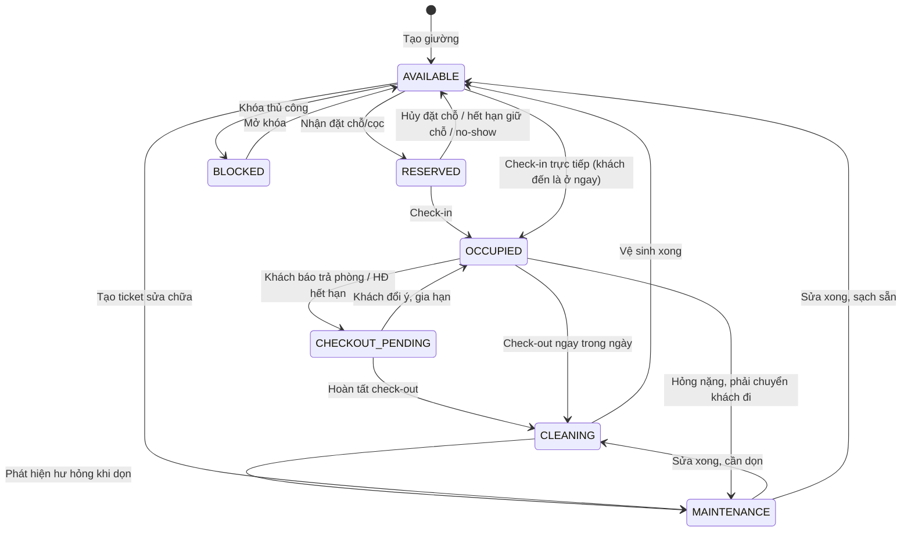
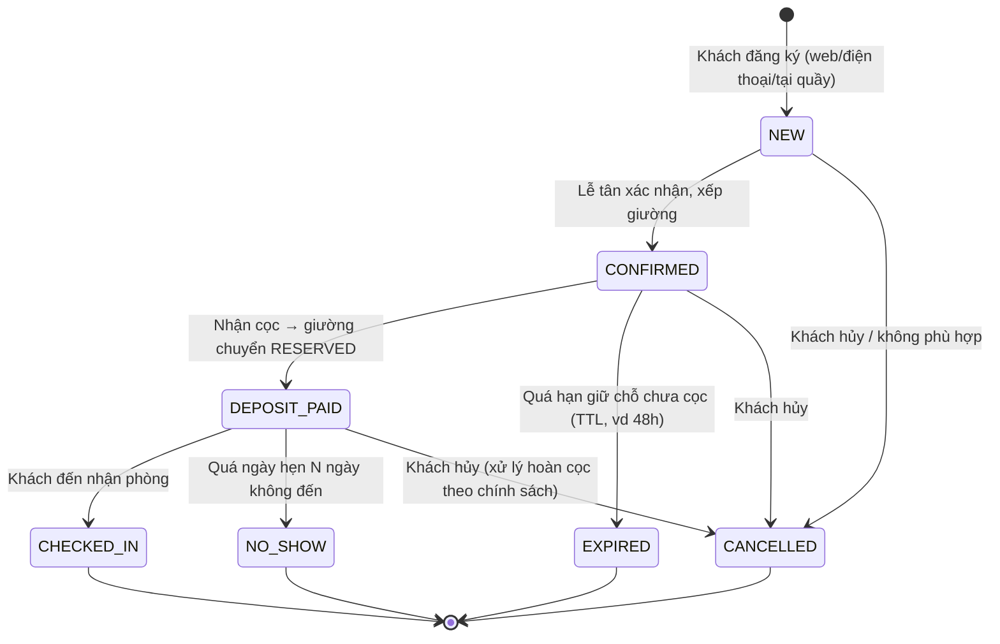
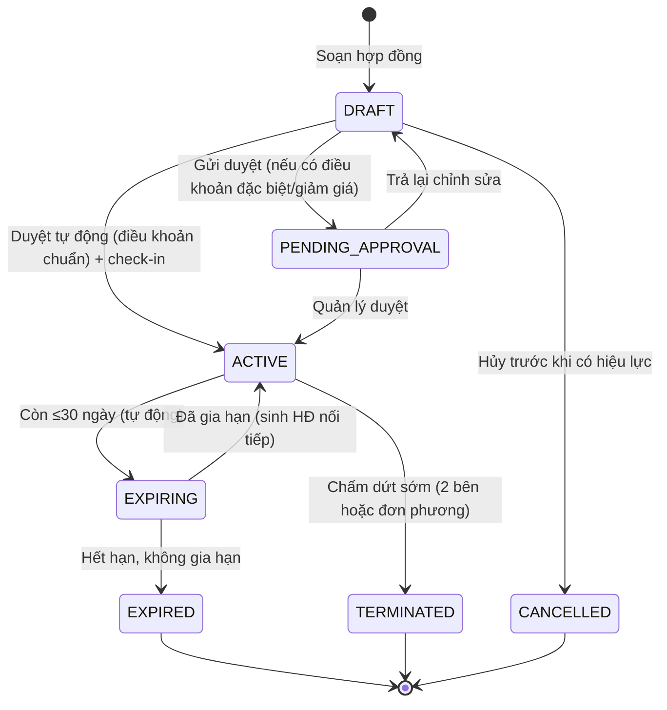
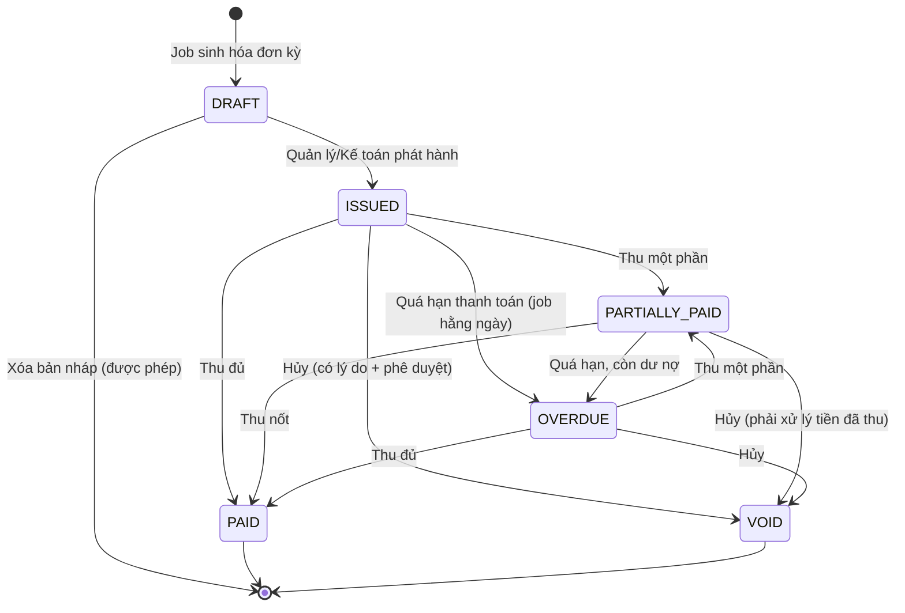
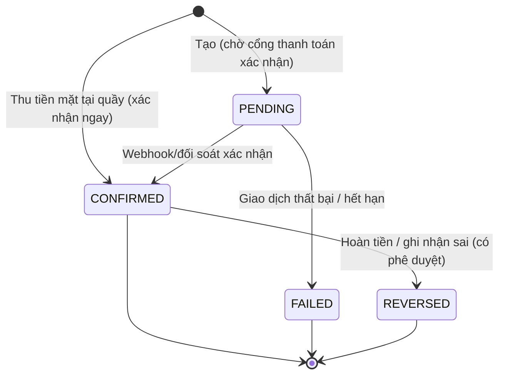
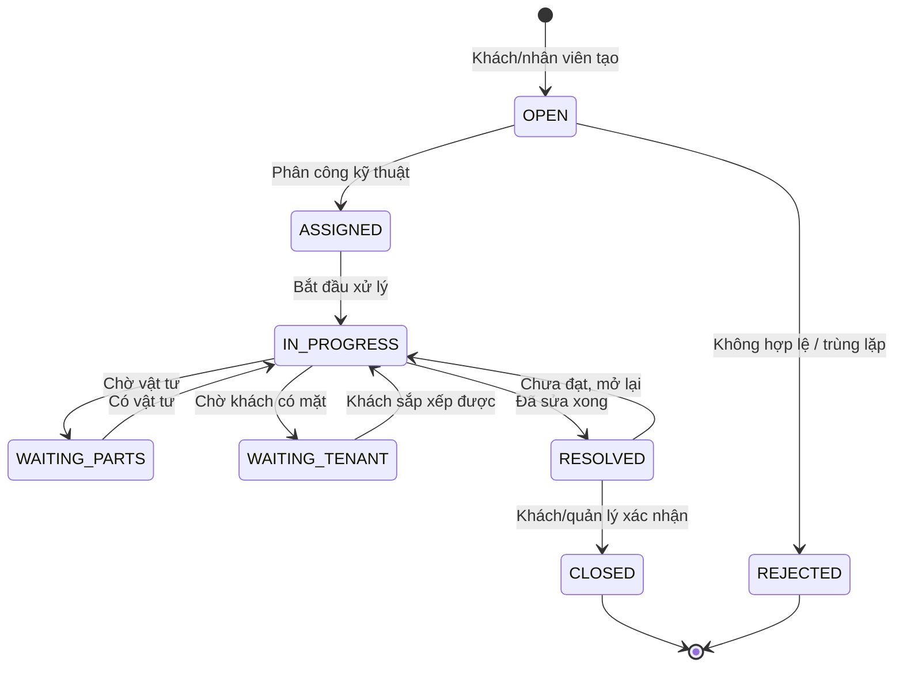
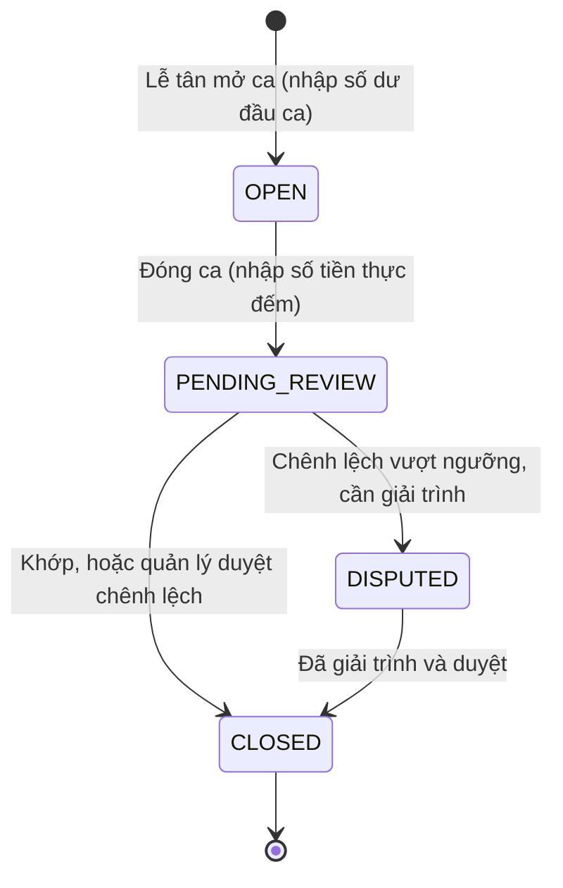

# 03 — Mô hình tổ chức & Máy trạng thái

## 1. Phân cấp

```
Organization — Cali
│   (chuẩn bị sẵn cho multi-tenant; hiện chỉ có 1 org)
│
└── Branch — Chi nhánh  ★ RANH GIỚI PHÂN QUYỀN
    │   Cấu hình riêng: bảng giá · dịch vụ · nội quy · kỳ thanh toán · giá điện nước
    │
    └── Building — Tòa nhà
        │   Chi phí vận hành gắn ở đây (thuê mặt bằng, điện tổng)
        │
        └── Floor — Tầng
            │   Đơn vị đi ghi chỉ số, phân công vệ sinh, sơ đồ trực quan
            │
            └── Room — Phòng
                │   Đơn vị vật lý: tiện ích, đồng hồ điện nước, tài sản
                │
                └── Bed — Giường  ★ ĐƠN VỊ BÁN
                        Đơn vị tồn kho, có giá riêng, gắn với hợp đồng
```

### Vì sao cấp nào tồn tại

| Cấp | Lý do tồn tại | Bỏ được không? |
|---|---|---|
| **Organization** | Chuẩn bị bán SaaS cho KTX khác. Thêm sau = migration đau đớn. | Không nên bỏ — chi phí thêm vào gần bằng 0 |
| **Branch** | Ranh giới phân quyền, ranh giới báo cáo, ranh giới cấu hình | Bắt buộc |
| **Building** | 1 chi nhánh thường có nhiều tòa. Chi phí thuê tính theo tòa. | Bắt buộc. Chi nhánh 1 tòa vẫn tạo "Tòa chính" |
| **Floor** | Dùng cho sơ đồ, phân công vệ sinh, đi ghi số | Bắt buộc |
| **Room** | Nơi đặt đồng hồ, tài sản, tiện ích | Bắt buộc |
| **Bed** | Đơn vị bán thực tế với mô hình ở ghép | Bắt buộc |

> **Quy tắc quan trọng:** Không có cấp nào được phép bỏ trống. Chi nhánh chỉ có 1 tòa vẫn phải tạo bản ghi tòa nhà. Lý do: tránh viết 2 nhánh code (`if (hasBuilding) ... else ...`), và tránh migration khi chi nhánh mở rộng thêm tòa.

---

## 2. Các trường hợp cần xử lý

### 2.1 Một chi nhánh có nhiều tòa nhà
Phổ biến: Cali Thủ Đức có tòa A (nam) và tòa B (nữ).

**Xử lý:** Quan hệ 1-n bình thường. Lưu ý:
- Tòa có thể có **giới tính quy định** (`genderPolicy: MALE | FEMALE | MIXED`) — rất phổ biến tại VN. Hệ thống phải chặn xếp khách nữ vào tòa nam.
- Chi phí vận hành (thuê mặt bằng, điện tổng) gắn ở cấp tòa để tính P&L chính xác.
- Tòa có thể ngừng hoạt động để cải tạo trong khi tòa khác vẫn chạy.

### 2.2 Một tòa nhà có nhiều tầng
**Xử lý:** 1-n. Lưu ý:
- Tầng trệt thường không có phòng ở (để xe, tiếp tân, căng tin) → cho phép tầng có 0 phòng.
- Đánh số tầng theo chuỗi (`"1"`, `"2"`, `"G"`, `"L"`) chứ không phải số nguyên — nhiều tòa ở VN không có tầng 4 hoặc tầng 13.
- Tầng có thể có quy định giới tính riêng (tòa hỗn hợp, tầng 3 nữ).

### 2.3 Một tầng có nhiều phòng
**Xử lý:** 1-n. Mã phòng unique theo chi nhánh, không unique toàn hệ thống.

### 2.4 Một phòng có nhiều giường
**Xử lý:** 1-n. Đây là mô hình chủ đạo của KTX.
- Số giường thực tế có thể khác `capacity` của loại phòng (phòng 6 người nhưng chỉ kê 4 giường do sửa chữa).
- `capacity` là sức chứa tối đa cho phép (dùng để chặn), số bản ghi `beds` là thực tế đang có.

### 2.5 Giường có nhiều trạng thái
Xem [§3 Máy trạng thái](#3-máy-trạng-thái).

### 2.6 Khách chuyển giường/phòng
**Xử lý — quyết định thiết kế quan trọng nhất:**

Hợp đồng **không** chứa `bedId`. Thay vào đó có collection `bed_assignments` — mỗi bản ghi là một **đoạn ở** của khách tại một giường trong một khoảng thời gian.

```
Hợp đồng HD-2026-0142 (01/09/2026 → 31/08/2027, 2.000.000đ/tháng)
├── Assignment #1: Giường A-301-B1, 01/09 → 14/10   (CHECK_IN)
├── Assignment #2: Giường A-305-B2, 15/10 → 31/12   (TRANSFER_ROOM)
└── Assignment #3: Giường B-201-B1, 01/01 → null    (TRANSFER_BUILDING, đang ở)
```

**Lợi ích:**
- Tính tiền phòng tháng 10 = duyệt assignment giao với khoảng [01/10, 31/10] → tự động prorate 14 ngày + 17 ngày. **Không cần code riêng cho nghiệp vụ chuyển phòng.**
- Lịch sử "ai từng ở giường A-301-B1" = query theo `bedId`.
- Lịch sử "khách này từng ở đâu" = query theo `customerId`.
- Chuyển chi nhánh cũng chỉ là một assignment mới với `branchId` khác → doanh thu tự phân bổ đúng chi nhánh.

**Nếu làm sai** (nhét `bedId` vào contract): mỗi lần chuyển phòng phải tạo hợp đồng mới (sai về mặt pháp lý), hoặc phải ghi log riêng rồi viết logic đặc biệt khi tính tiền. Mọi báo cáo lịch sử đều trở nên khó.

### 2.7 Một khách thuê nhiều dịch vụ
**Xử lý:** `service_subscriptions` — bản ghi đăng ký dịch vụ gắn với hợp đồng.
- Có ngày bắt đầu/kết thúc (khách dùng giữ xe từ tháng 3 đến tháng 7).
- Có chu kỳ: hằng tháng (giữ xe), theo lần (giặt sấy), một lần (phí làm thẻ).
- Dịch vụ tính theo lần thì ghi nhận từng lần dùng (`service_usages`), cuối kỳ tổng hợp vào hóa đơn.

### 2.8 Một phòng có nhiều loại giường / nhiều giá
**Rất phổ biến tại VN:** giường tầng dưới đắt hơn giường tầng trên 100–200k.

**Xử lý — thứ tự ưu tiên giá (fallback chain):**
```
Giá áp dụng = bed.priceOverride
           ?? room.priceOverride
           ?? roomType.basePrice (theo chi nhánh)
```
Ngoài ra có thể áp **hệ số theo thời hạn thuê**: thuê ≥12 tháng giảm 5%. Hệ số này là quy tắc trong bảng giá chi nhánh, áp dụng lúc tạo hợp đồng và **snapshot vào hợp đồng**.

> **Quy tắc bất di bất dịch:** giá được **snapshot vào hợp đồng và vào assignment** tại thời điểm ký/gán. Đổi bảng giá sau đó **không bao giờ** ảnh hưởng hợp đồng đang chạy. Xem [17-edge-cases.md](17-edge-cases.md) case 15.

### 2.9 Thuê nguyên phòng
Người đi làm hoặc nhóm bạn thuê trọn phòng 4 giường.

**Xử lý:** Không tạo model mới. Một hợp đồng có nhiều assignment đồng thời (4 giường cùng lúc), hoặc hợp đồng có `wholeRoom: true` và giữ tất cả giường của phòng. Giá là giá phòng, không phải tổng giá giường.
Nếu sau đó khách trả bớt 1 giường → đóng 1 assignment, giá hợp đồng điều chỉnh có phê duyệt.

### 2.10 Ghép phòng theo yêu cầu
Sinh viên muốn ở cùng bạn. Hoặc yêu cầu "cùng giới", "cùng trường", "không hút thuốc".

**Xử lý:** Trường `roommatePreferences` trên booking (tự do văn bản + vài cờ có cấu trúc). Khi lễ tân xếp giường, hệ thống hiển thị ghi chú này. **Không tự động ghép** — đây là việc con người làm tốt hơn.

---

## 3. Máy trạng thái

### 3.1 Trạng thái giường (Bed Status)



| Trạng thái | Nghĩa | Bán được? | Ai đổi được |
|---|---|---|---|
| `AVAILABLE` | Sẵn sàng cho thuê | ✅ | Hệ thống |
| `RESERVED` | Đang giữ chỗ (có hoặc chưa có cọc) | ❌ | Lễ tân (qua booking) |
| `OCCUPIED` | Đang có người ở | ❌ | Hệ thống (qua check-in) |
| `CHECKOUT_PENDING` | Đã báo trả, chưa hoàn tất thủ tục | ❌ (bán được cho ngày tương lai) | Lễ tân |
| `CLEANING` | Chờ dọn dẹp | ❌ | Tạp vụ, lễ tân |
| `MAINTENANCE` | Đang sửa chữa | ❌ | Kỹ thuật, quản lý |
| `BLOCKED` | Khóa thủ công (cải tạo, giữ cho nội bộ, không cho thuê) | ❌ | Quản lý chi nhánh |

**Ba quy tắc bắt buộc:**

1. **Check-out KHÔNG đưa giường về `AVAILABLE`.** Luôn đi qua `CLEANING`. Nếu bỏ bước này, hệ thống sẽ bán giường chưa dọn. Đây là lỗi vận hành gây khiếu nại nhiều nhất.

2. **`beds.status` là dữ liệu dẫn xuất, không phải nguồn sự thật.** Nguồn sự thật là `bed_assignments` (đang ở hay không) + `maintenance_tickets` (đang sửa hay không) + `bookings` (đang giữ chỗ hay không). Phải có job nightly quét và cảnh báo lệch trạng thái — vì lễ tân sẽ quên bấm nút.

3. **Trạng thái hiện tại ≠ khả dụng trong tương lai.** Một giường `MAINTENANCE` hôm nay vẫn có thể nhận booking cho tháng sau. Hàm kiểm tra khả dụng phải là `isAvailableForPeriod(bedId, from, to)` — kiểm tra xung đột với assignment và booking trong khoảng đó, không phải chỉ nhìn `status`.

### 3.2 Trạng thái đặt chỗ (Booking)



**Quy tắc:**
- `CONFIRMED` giữ giường nhưng **có thời hạn** (`holdUntil`). Hết hạn tự động trả giường. Nếu không có cơ chế này, lễ tân sẽ giữ giường ảo cho khách "đang suy nghĩ" và tỷ lệ lấp đầy tụt.
- `NO_SHOW` và `CANCELLED` là hai trạng thái khác nhau — chính sách hoàn cọc khác nhau.
- Chuyển sang `CHECKED_IN` phải trong cùng transaction với việc tạo assignment.

### 3.3 Trạng thái hợp đồng (Contract)



**Quy tắc:**
- `EXPIRING` là trạng thái do job tự động gán, không phải người bấm. Dùng để lọc danh sách cần chăm sóc.
- **Gia hạn = sinh hợp đồng MỚI** nối tiếp (`previousContractId`), không phải sửa ngày kết thúc của hợp đồng cũ. Lý do: giá có thể đổi, điều khoản có thể đổi, và phải giữ được lịch sử pháp lý.
- Nếu không đổi giường, assignment giữ nguyên, chỉ đổi `contractId` tham chiếu (hoặc đóng và mở assignment mới cùng giường — chọn cách đóng/mở để lịch sử nhất quán).
- Hợp đồng hết hạn mà khách vẫn ở và không ký mới → theo điều khoản, tự chuyển sang thuê tháng (`autoRenewMonthly`) + cảnh báo. **Không được** để hệ thống rơi vào trạng thái "đang ở mà không có hợp đồng".

### 3.4 Trạng thái hóa đơn (Invoice)



**Quy tắc sống còn:**
- **`DRAFT` xóa/sửa thoải mái. Từ `ISSUED` trở đi: bất biến.** Muốn thay đổi → tạo `invoice_adjustment` (bút toán điều chỉnh) tham chiếu hóa đơn gốc, có lý do bắt buộc, có phê duyệt, có audit.
- `VOID` chỉ dùng khi hóa đơn lập nhầm hoàn toàn. Nếu đã có tiền thu, tiền đó chuyển thành **credit balance** của khách.
- `OVERDUE` do job đặt, nhưng khi thu tiền phải quay về `PARTIALLY_PAID`/`PAID` đúng.
- **Sinh hóa đơn hàng loạt luôn tạo ở `DRAFT`.** Không bao giờ auto-`ISSUED` — vì tháng nào cũng có vài trường hợp bất thường cần người xem.

### 3.5 Trạng thái thanh toán (Payment)



**Quy tắc:** Không bao giờ **xóa** payment. Ghi nhận sai thì `REVERSED` kèm lý do, và tạo payment đúng. Lý do: kiểm toán tiền phải thấy được cả sai sót lẫn cách sửa.

### 3.6 Trạng thái ticket bảo trì



**Quy tắc:**
- SLA đếm theo thời gian ở các trạng thái `OPEN`, `ASSIGNED`, `IN_PROGRESS`. **Không đếm** thời gian ở `WAITING_PARTS`/`WAITING_TENANT` — nếu không, kỹ thuật bị phạt oan vì lý do ngoài tầm kiểm soát.
- `RESOLVED` → `CLOSED` nên có xác nhận từ người tạo. Nếu 48h không phản hồi thì tự đóng.

### 3.7 Trạng thái két tiền mặt (Cash Session)



---

## 4. Bảng tóm tắt quan hệ dữ liệu

| Quan hệ | Kiểu | Ghi chú |
|---|---|---|
| Organization → Branch | 1-n | |
| Branch → Building | 1-n | Chi nhánh luôn có ≥1 tòa |
| Building → Floor | 1-n | Tầng có thể có 0 phòng |
| Floor → Room | 1-n | Mã phòng unique theo branch |
| Room → Bed | 1-n | Số giường ≤ capacity của loại phòng |
| RoomType → Room | 1-n | Loại phòng định nghĩa theo chi nhánh |
| Customer → Contract | 1-n | Một khách nhiều hợp đồng theo thời gian |
| Contract → BedAssignment | 1-n | **Quan hệ quan trọng nhất** |
| Bed → BedAssignment | 1-n | Lịch sử người ở |
| Contract → Invoice | 1-n | Một hóa đơn/kỳ |
| Invoice → InvoiceLine | 1-n | |
| Payment ↔ Invoice | n-n qua `payment_allocations` | Một khoản trả nhiều hóa đơn và ngược lại |
| Contract → DepositLedger | 1-n | Sổ cọc theo hợp đồng |
| Room → UtilityMeter | 1-n | Có thể 1 đồng hồ dùng chung nhiều phòng |
| Branch → Service | 1-n | Dịch vụ cấu hình theo chi nhánh |
| Contract → ServiceSubscription | 1-n | |
| User ↔ Branch | n-n qua `user_role_assignments` | Một người quản nhiều chi nhánh |
