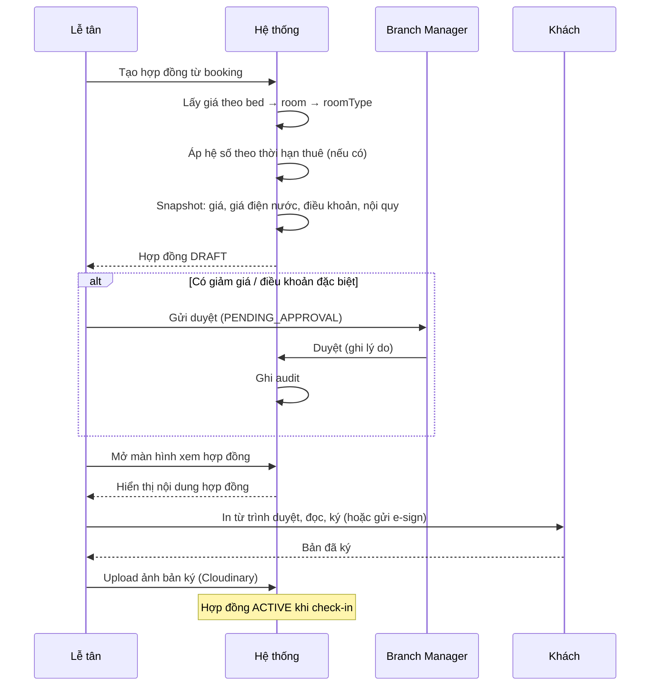

# 08 — Module Hợp đồng

---

## 1. Mục đích

Hợp đồng là **văn bản pháp lý và là nguồn của mọi nghĩa vụ tài chính định kỳ**. Không có hợp đồng thì không sinh được hóa đơn. Khách đang ở mà không có hợp đồng trong hệ thống là lỗi nghiêm trọng — hệ thống phải không cho phép trạng thái đó tồn tại.

**Nguyên tắc cốt lõi:** hợp đồng **snapshot** toàn bộ điều khoản và giá tại thời điểm ký. Thay đổi bảng giá sau đó không bao giờ ảnh hưởng hợp đồng đang chạy.

---

## 2. Dữ liệu

| Nhóm | Trường | Ghi chú |
|---|---|---|
| **Định danh** | `contractNo` | `HD-TD-2026-0142` — sinh từ `counters`, unique toàn hệ thống |
| | `version` | Số lần sửa đổi (phụ lục) |
| **Các bên** | `customerId` | Bên thuê |
| | `guardianInfo` | Người giám hộ ký thay (khách vị thành niên) |
| | `branchId` | Bên cho thuê — chi nhánh nào |
| | `signedByStaffId` | Nhân viên đại diện ký |
| **Đối tượng thuê** | `wholeRoom: boolean` | Thuê nguyên phòng hay theo giường |
| | `bedIds[]` | Giường **dự kiến** tại thời điểm ký. Thực tế ở đâu lấy từ `bed_assignments` |
| | *(không có `roomId`/`bedId` đơn lẻ)* | **Quan trọng** — xem [03-org-model.md §2.6](03-org-model.md) |
| **Thời hạn** | `startDate`, `endDate` | |
| | `durationMonths` | |
| | `autoRenewMonthly` | Hết hạn không ký mới thì tự chuyển thuê tháng |
| | `noticePeriodDays` | Số ngày báo trước khi trả phòng (mặc định 30) |
| **Tài chính** | `monthlyRent` | **Snapshot** giá tại thời điểm ký |
| | `depositAmount` | Tiền cọc |
| | `depositMonths` | Số tháng cọc (thường 1–2) |
| | `billingCycle` | `MONTHLY` / `QUARTERLY` / `SEMESTER` / `YEARLY` |
| | `billingDayOfMonth`, `dueDayOfMonth` | Kế thừa từ chi nhánh, có thể override |
| | `electricityPrice`, `waterPrice` | **Snapshot** đơn giá điện nước tại thời điểm ký — nếu không snapshot, tăng giá điện giữa chừng sẽ gây tranh chấp |
| | `includedServices[]` | Dịch vụ đã bao gồm trong giá (internet, vệ sinh khu chung) |
| | `discounts[]` | Giảm giá dài hạn: loại, số tiền/%, lý do, người duyệt, thời hạn |
| **Điều khoản** | `templateId` | Template dùng để sinh |
| | `termsSnapshot` | **Toàn văn điều khoản tại thời điểm ký** — không trỏ tới template (template có thể đổi) |
| | `specialTerms` | Điều khoản riêng thỏa thuận thêm |
| | `houseRulesVersion` | Phiên bản nội quy khách đã ký nhận |
| **Trạng thái** | `status` | Xem [03-org-model.md §3.3](03-org-model.md) |
| | `approvedBy`, `approvedAt` | |
| | `terminatedAt`, `terminationReason`, `terminationType` | `MUTUAL` / `BY_TENANT` / `BY_LANDLORD` / `ABANDONMENT` |
| **Liên kết** | `bookingId` | Booking nguồn |
| | `previousContractId` | Hợp đồng trước (khi gia hạn) |
| | `nextContractId` | Hợp đồng gia hạn |
| **Tài liệu** | *(không có `pdfUrl`)* | Hệ thống không tạo/lưu file PDF — hợp đồng chỉ tồn tại dạng dữ liệu, xem/duyệt trực tiếp trong hệ thống. Khi cần bản in để ký tay, in trực tiếp từ màn hình xem. Xem [11-architecture.md §7.2](11-architecture.md) |
| | `signedDocumentImage` | Ảnh (Cloudinary) bản đã ký tay/đóng dấu — chụp lại để lưu bằng chứng, không phải PDF sinh sẵn |
| | `signatureMethod` | `PAPER` / `ELECTRONIC` |
| | `signedAt` | |

---

## 3. Thao tác

| Thao tác | Ai | Ghi chú |
|---|---|---|
| Soạn hợp đồng | Lễ tân, Branch Manager | Từ booking hoặc tạo trực tiếp |
| Sinh từ template | Hệ thống | Điền biến tự động, hiển thị trên màn hình xem |
| In trực tiếp từ màn hình xem | Lễ tân trở lên | Không sinh/lưu file PDF — dùng chức năng in của trình duyệt khi cần bản giấy |
| Gửi duyệt | Lễ tân | Khi có điều khoản đặc biệt hoặc giảm giá |
| Duyệt | Branch Manager | |
| Kích hoạt | Hệ thống | Tự động khi check-in |
| Gia hạn | Lễ tân, Branch Manager | Sinh hợp đồng mới nối tiếp |
| Sửa đổi (phụ lục) | Branch Manager | Tăng `version`, giữ bản cũ |
| Chấm dứt sớm | Branch Manager (duyệt) | Ghi lý do bắt buộc |
| Tải/in | Mọi vai trò có quyền xem | |

---

## 4. Template hợp đồng

### 4.1 Cấu trúc
```
Template (theo chi nhánh hoặc dùng chung)
├── code, name, version
├── body: HTML/Markdown có biến thay thế
├── variables: danh sách biến hợp lệ
├── isDefault, status
└── effectiveFrom, effectiveTo
```

### 4.2 Biến hệ thống hỗ trợ
```
{{contract.no}}              {{contract.startDate}}      {{contract.endDate}}
{{contract.monthlyRent}}     {{contract.monthlyRentText}}  ← đọc thành chữ
{{contract.depositAmount}}   {{contract.billingCycle}}
{{customer.fullName}}        {{customer.idNumber}}        {{customer.dateOfBirth}}
{{customer.permanentAddress}} {{customer.phone}}
{{guardian.fullName}}        {{guardian.idNumber}}
{{branch.name}}              {{branch.address}}           {{branch.phone}}
{{room.code}}                {{bed.code}}
{{utility.electricityPrice}} {{utility.waterPrice}}
{{today}}                    {{signatory.fullName}}       {{signatory.position}}
```

> **Bắt buộc có `monthlyRentText`** (số tiền bằng chữ) — hợp đồng tại Việt Nam thường yêu cầu ghi cả số và chữ.

### 4.3 Quản lý phiên bản template
- Sửa template → tạo phiên bản mới, **không sửa đè**
- Hợp đồng đã ký giữ `termsSnapshot` — không bao giờ đổi nội dung theo template mới
- Template có `effectiveFrom` để lên lịch áp dụng từ ngày nào

---

## 5. Workflow

### 5.1 Tạo hợp đồng mới


### 5.2 Gia hạn hợp đồng
```
D-30: Hệ thống cảnh báo → hợp đồng chuyển EXPIRING
      Thông báo tới khách + lễ tân
D-15: Nhắc lần 2
D-7:  Nhắc lần 3 + đưa vào danh sách ưu tiên xử lý

Khách đồng ý gia hạn:
  → Tạo hợp đồng MỚI: previousContractId = HĐ cũ
  → Giá: có thể giữ hoặc điều chỉnh (nếu tăng, cần thông báo trước theo điều khoản)
  → startDate = endDate của HĐ cũ + 1 ngày (liền mạch, không hở ngày)
  → Cọc: giữ nguyên, chuyển sang HĐ mới (KHÔNG hoàn rồi thu lại)
  → Giường: giữ nguyên → đóng assignment cũ, mở assignment mới cùng giường
     (để lịch sử nhất quán, mỗi assignment thuộc đúng 1 hợp đồng)
  → HĐ cũ → EXPIRED, nextContractId trỏ tới HĐ mới

Khách không phản hồi đến ngày hết hạn:
  → Nếu autoRenewMonthly: tự chuyển sang thuê tháng, cảnh báo quản lý
  → Nếu không: hợp đồng EXPIRED, khách vào danh sách "đang ở không hợp đồng" — CẢNH BÁO ĐỎ
     Không được để trạng thái này kéo dài
```

**Vì sao gia hạn = hợp đồng mới, không phải sửa ngày hết hạn:**
- Giá có thể đổi → cần snapshot mới
- Điều khoản có thể đổi
- Pháp lý: cần văn bản riêng cho mỗi kỳ hạn
- Báo cáo: đếm được "số hợp đồng ký mới trong tháng", "tỷ lệ gia hạn"

### 5.3 Chấm dứt sớm
```
Khách báo trả phòng
  → Kiểm tra noticePeriodDays: báo đủ sớm không?
      Đủ  → không phạt
      Thiếu → phạt theo điều khoản (thường tính tiền phòng những ngày thiếu, hoặc mất cọc)
  → Lễ tân tạo đề nghị chấm dứt, ghi lý do
  → Branch Manager duyệt
  → Đặt ngày chấm dứt dự kiến
  → Giường chuyển CHECKOUT_PENDING (bán được cho ngày sau đó)
  → Đến ngày → chạy quy trình check-out
```

**Chấm dứt do Cali (đơn phương):** cần lý do hợp lệ theo hợp đồng (vi phạm nghiêm trọng, không thanh toán kéo dài). Quy trình phải có: cảnh báo bằng văn bản → thời hạn khắc phục → quyết định chấm dứt. Mọi bước lưu bằng chứng.

---

## 6. Cảnh báo & tự động hóa

| Thời điểm | Hành động |
|---|---|
| D-30 trước hết hạn | Hợp đồng → `EXPIRING`. Thông báo khách + lễ tân |
| D-15 | Nhắc lần 2 |
| D-7 | Nhắc lần 3, đưa lên đầu danh sách việc của quản lý |
| Ngày hết hạn | Nếu chưa xử lý → cảnh báo đỏ trên dashboard |
| D+1 sau hết hạn, khách vẫn ở | Tự chuyển thuê tháng (nếu `autoRenewMonthly`) hoặc cảnh báo nghiêm trọng |
| Hợp đồng `DRAFT` quá 7 ngày | Nhắc lễ tân hoàn tất hoặc hủy |
| Khách đang ở mà không có hợp đồng `ACTIVE` | **Cảnh báo đỏ liên tục** cho tới khi xử lý |

---

## 7. Ký điện tử (Phase 3)

### 7.1 Có nên làm không?
| Lợi | Hại |
|---|---|
| Khách ở xa ký được trước khi đến | Chi phí dịch vụ e-sign |
| Không cần in, không mất bản giấy | Giá trị pháp lý cần dịch vụ đạt chuẩn chữ ký số |
| Gia hạn hợp đồng online rất tiện | Khách lớn tuổi/phụ huynh có thể không quen |

**Khuyến nghị:** Phase 3, và bắt đầu từ **gia hạn hợp đồng** (khách đã quen hệ thống, giao dịch đơn giản) thay vì hợp đồng đầu tiên.

Giai đoạn 1–2 dùng cách đơn giản hơn: xem hợp đồng trên hệ thống → in từ trình duyệt → ký tay → chụp ảnh → upload (Cloudinary). Đủ dùng và không tốn chi phí.

---

## 8. Quyền
Xem [04-roles-permissions.md](04-roles-permissions.md) dòng 30–36.

Điểm cần lưu ý:
- Lễ tân **soạn được** nhưng **không duyệt được** hợp đồng có điều khoản đặc biệt
- Chấm dứt sớm luôn cần Branch Manager duyệt (vì liên quan tiền phạt và cọc)
- Template chỉ Super Admin quản lý — tránh mỗi chi nhánh tự sửa điều khoản pháp lý

---

## 9. Edge case

| # | Tình huống | Xử lý |
|---|---|---|
| 1 | **Khách ở quá hạn không ký hợp đồng mới** | `autoRenewMonthly` chuyển sang thuê tháng theo giá hiện hành; nếu không có điều khoản này → cảnh báo đỏ, buộc xử lý trong N ngày |
| 2 | **Đổi bảng giá giữa kỳ hợp đồng** | Không ảnh hưởng. Giá đã snapshot. Chỉ áp cho hợp đồng ký sau |
| 3 | **Tăng giá khi gia hạn** | Phải thông báo trước theo số ngày quy định trong hợp đồng cũ. Hệ thống ghi nhận ngày thông báo làm bằng chứng |
| 4 | **Khách chuyển chi nhánh giữa hợp đồng** | Hai lựa chọn: (a) chấm dứt HĐ cũ + ký HĐ mới ở chi nhánh mới (rõ ràng về kế toán, **khuyến nghị**); (b) giữ HĐ, chỉ đổi assignment sang chi nhánh khác (đơn giản cho khách nhưng doanh thu phân bổ phức tạp). Chọn (a) |
| 5 | **Một hợp đồng nhiều người** (nhóm bạn thuê nguyên phòng) | Một người đứng tên chính (`customerId`), những người khác là `coTenants[]` có hồ sơ riêng. Nghĩa vụ tài chính thuộc người đứng tên. Vẫn cần hồ sơ đầy đủ của tất cả để khai tạm trú |
| 6 | **Khách muốn đổi chu kỳ thanh toán giữa chừng** (tháng → quý) | Tạo phụ lục (`version` +1). Áp dụng từ kỳ kế tiếp, không hồi tố kỳ đang chạy |
| 7 | **Hợp đồng ký nhưng khách không đến** | Hợp đồng chưa `ACTIVE` (chỉ `ACTIVE` khi check-in). Hủy hợp đồng, xử lý cọc theo chính sách no-show |
| 8 | **Hợp đồng sai thông tin đã ký** | Sửa lỗi nhỏ (chính tả tên): sửa + ghi audit + in lại. Sai điều khoản/giá: phụ lục có chữ ký 2 bên |
| 9 | **Mất bản hợp đồng giấy** | Dữ liệu hợp đồng trong hệ thống là bản gốc tham chiếu. Xem lại và in lại được bất cứ lúc nào từ màn hình xem. Đây là một lý do quan trọng để số hóa |
| 10 | **Khách vị thành niên tròn 18 tuổi giữa hợp đồng** | Không cần làm gì với hợp đồng đang chạy. Hợp đồng gia hạn sau đó khách tự ký |
| 11 | **Hợp đồng chồng lấn thời gian trên cùng một giường** | Ràng buộc ở `bed_assignments` (unique partial index) chặn. Hợp đồng thì có thể chồng lấn nếu khách đổi giường |
| 12 | **Chấm dứt hợp đồng nhưng còn hóa đơn chưa thu** | Hợp đồng vẫn chấm dứt được, công nợ chuyển sang theo dõi ở hồ sơ khách. Không giữ hợp đồng "sống" chỉ để đòi nợ |
| 13 | **Khách trong danh sách đen quay lại ký hợp đồng** | Cảnh báo bắt buộc + cần Branch Manager duyệt mới cho ký |
| 14 | **Hợp đồng theo học kỳ (sinh viên)** | `billingCycle = SEMESTER`, thu trước cả kỳ. Nếu khách trả phòng giữa kỳ → hoàn phần chưa dùng (prorate), trừ phí phạt nếu vi phạm thời hạn báo trước |
