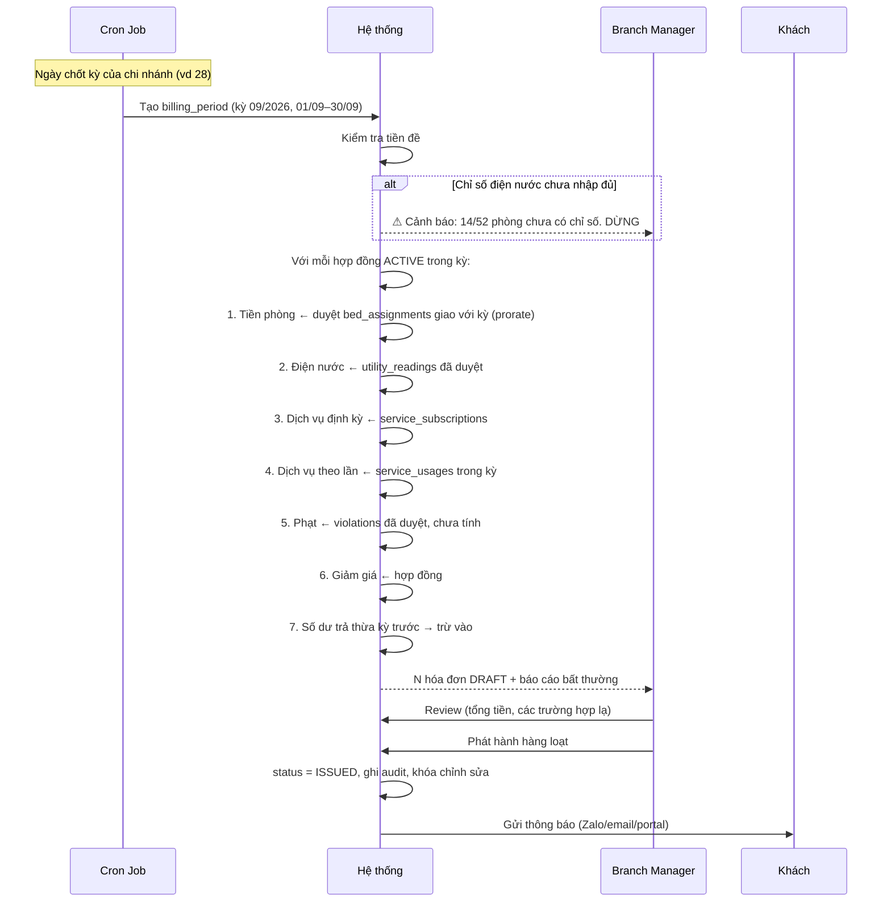

# 09 — Module Tài chính: Hóa đơn · Điện nước · Dịch vụ · Thanh toán · Công nợ · Cọc · Két · Chi phí

> Đây là module quan trọng nhất và rủi ro nhất của hệ thống. Mọi thiết kế ở đây phải đặt **khả năng kiểm toán** lên trên **sự tiện lợi**.

---

## 0. Bảy nguyên tắc tài chính bất di bất dịch

| # | Nguyên tắc | Hệ quả kỹ thuật |
|---|---|---|
| 1 | **Tiền lưu dạng số nguyên VNĐ** | `Int64`, không bao giờ `Double`. Mọi phép chia có quy tắc làm tròn cố định |
| 2 | **Hóa đơn `ISSUED` là bất biến** | Không có API `UPDATE`. Chỉ có `invoice_adjustments` |
| 3 | **Tiền cọc không phải doanh thu** | Sổ cọc riêng, không bao giờ vào báo cáo doanh thu |
| 4 | **Doanh thu ghi nhận theo kỳ dịch vụ, không theo ngày thu tiền** | Khách trả trước 6 tháng ≠ doanh thu tháng này |
| 5 | **Mỗi giao dịch tiền có idempotency key** | Chống ghi nhận trùng, đặc biệt với webhook |
| 6 | **Không xóa chứng từ tiền, chỉ đảo** | `REVERSED` + chứng từ mới, không `DELETE` |
| 7 | **Mọi thay đổi tài chính có lý do bắt buộc + audit** | `reason` là trường required trong API |

### Quy tắc làm tròn
```
Mọi số tiền trên hóa đơn làm tròn tới 1.000đ (làm tròn nửa lên).
Khi chia đều (tiền điện theo đầu người), phần dư dồn vào người cuối cùng
  theo thứ tự mã khách, và ghi rõ trong dòng hóa đơn:
  "Tiền điện P301 (chia 4 người, đã gồm phần làm tròn 500đ)"
```
Lý do phải ghi rõ: lễ tân sẽ bị hỏi "sao em trả nhiều hơn bạn em 500 đồng?" và phải trả lời được.

---

## 1. Hóa đơn (Invoice)

### 1.1 Mục đích
Chứng từ ghi nhận nghĩa vụ thanh toán của khách trong một kỳ.

### 1.2 Dữ liệu
Xem chi tiết field và index tại [12-database-schema.md](12-database-schema.md).

Điểm quan trọng: hóa đơn có **`snapshot`** đóng băng thông tin hiển thị:
```js
snapshot: {
  customerName, customerPhone, idNumber, customerAddress,
  branchName, branchAddress, roomCode, bedCode,
  contractNo, monthlyRent
}
```
**Vì sao:** in lại hóa đơn tháng 3 phải ra đúng phòng khách ở tháng 3, không phải phòng hiện tại. Nếu chỉ lưu `customerId` và join lúc in, mọi hóa đơn cũ sẽ đổi nội dung khi khách chuyển phòng hoặc đổi tên.

### 1.3 Các loại dòng hóa đơn (InvoiceLine)

| `lineType` | Nguồn | Cách tính |
|---|---|---|
| `RENT` | `bed_assignments` giao với kỳ | Prorate theo số ngày ở × đơn giá ngày |
| `ELECTRICITY` | `utility_readings` | (Chỉ số cuối − đầu) × đơn giá, hoặc chia theo đầu người |
| `WATER` | `utility_readings` | Tương tự, hoặc theo đầu người (phổ biến hơn) |
| `SERVICE_RECURRING` | `service_subscriptions` | Giá dịch vụ × chu kỳ, prorate nếu đăng ký/hủy giữa kỳ |
| `SERVICE_USAGE` | `service_usages` | Số lần dùng × đơn giá |
| `PENALTY` | `violations` đã duyệt | Mức phạt theo nội quy |
| `LATE_FEE` | Tự sinh | Theo chính sách trễ hạn của chi nhánh |
| `DAMAGE` | Biên bản check-out / ticket | Định giá thiệt hại |
| `ONE_TIME` | Nhập tay | Phí làm thẻ, thay chìa khóa, phí dọn đặc biệt |
| `DISCOUNT` | Hợp đồng hoặc nhập tay | Số âm. Có lý do + người duyệt |
| `ADJUSTMENT` | `invoice_adjustments` | Số dương hoặc âm |

Mỗi dòng có: `description` (câu chữ lễ tân đọc được cho khách), `quantity`, `unitPrice`, `amount`, `calculationNote` (giải thích cách tính), `sourceRef` (trỏ về bản ghi nguồn).

> **`calculationNote` là trường quan trọng bị bỏ quên nhiều nhất.** Ví dụ: `"Chỉ số 4521 → 4587 = 66 kWh × 3.500đ"`. Có nó thì khách không cãi, không có thì lễ tân phải tự tính lại bằng máy tính cầm tay.

### 1.4 Quy trình sinh hóa đơn kỳ



**Báo cáo bất thường kèm theo bản nháp** — đây là thứ giúp quản lý review 15 phút thay vì 2 giờ:
- Hóa đơn chênh >30% so với kỳ trước của cùng khách
- Tiền điện chênh >50% so với trung bình 3 kỳ
- Hợp đồng `ACTIVE` nhưng không sinh được hóa đơn (thiếu dữ liệu)
- Khách có assignment nhưng không có hợp đồng
- Hóa đơn 0 đồng hoặc âm

**Nguyên tắc:** không bao giờ tự động phát hành. Tháng nào cũng có vài trường hợp bất thường cần mắt người.

### 1.5 Prorate tiền phòng — logic

```
Kỳ: 01/09/2026 → 30/09/2026 (30 ngày)

Duyệt bed_assignments của hợp đồng, giao với kỳ:
  Assignment #1: giường A-301-B1, 01/09 → 14/09  (14 ngày, 2.000.000đ/tháng)
  Assignment #2: giường A-305-B2, 15/09 → 30/09  (16 ngày, 2.200.000đ/tháng)

Đơn giá ngày = tiền tháng ÷ số ngày của tháng đó
  #1: 2.000.000 ÷ 30 = 66.667đ/ngày × 14 = 933.333đ
  #2: 2.200.000 ÷ 30 = 73.333đ/ngày × 16 = 1.173.333đ
  Tổng thô = 2.106.666đ → làm tròn 1.000đ = 2.107.000đ

Dòng hóa đơn:
  "Tiền phòng A-301-B1 (01/09–14/09, 14 ngày)"    933.000đ
  "Tiền phòng A-305-B2 (15/09–30/09, 16 ngày)"  1.174.000đ
```

**Quyết định cần chốt:** đơn giá ngày = tiền tháng ÷ **số ngày thực của tháng** (28/29/30/31) hay ÷ **30 cố định**?

| Phương án | Ưu | Nhược |
|---|---|---|
| ÷ số ngày thực | Công bằng tuyệt đối, tổng luôn khớp tiền tháng | Đơn giá ngày đổi theo tháng, khách thắc mắc |
| **÷ 30 cố định** ✅ | Đơn giá ngày ổn định, dễ giải thích | Tháng 31 ngày ở trọn thì tổng > tiền tháng |

**Khuyến nghị: ÷ 30 cố định, NHƯNG nếu ở trọn tháng thì lấy đúng tiền tháng, không nhân theo ngày.** Đây là cách hầu hết KTX VN làm và khách dễ chấp nhận nhất. Ghi rõ quy tắc trong hợp đồng.

### 1.6 Bút toán điều chỉnh (Invoice Adjustment)

Khi hóa đơn `ISSUED` có sai sót:

```
Hóa đơn HD-000142 (đã phát hành)  2.850.000đ
  └─ Điều chỉnh ADJ-000007:        −350.000đ
     Lý do: "Ghi nhầm chỉ số điện, đúng là 4587 không phải 4687"
     Tham chiếu: utility_readings/xxx
     Đề xuất: Kế toán Mai · Duyệt: Branch Manager Hương · 03/10/2026 14:22
  └─ Số phải thu sau điều chỉnh:  2.500.000đ
```

**Quy tắc:**
- Hóa đơn gốc **không đổi một ký tự nào**
- Điều chỉnh là bản ghi riêng, có `reason` bắt buộc, có người đề xuất ≠ người duyệt
- In hóa đơn hiển thị cả gốc và các điều chỉnh
- Báo cáo dùng số sau điều chỉnh

### 1.7 Edge case hóa đơn
| Tình huống | Xử lý |
|---|---|
| **Khách check-in giữa kỳ** | Prorate từ ngày vào. Hóa đơn đầu tiên thường lẻ |
| **Khách check-out giữa kỳ** | Hóa đơn quyết toán riêng, sinh ngay lúc check-out, không chờ chốt kỳ |
| **Hóa đơn 0 đồng** | Vẫn sinh (để có dấu vết), đánh dấu, không gửi thông báo |
| **Hóa đơn âm** (giảm giá > phí) | Chuyển thành số dư trả thừa (credit balance), không sinh hóa đơn âm |
| **Sinh hóa đơn 2 lần cho cùng kỳ** | Unique index `{contractId, billingPeriodId}` chặn |
| **Hợp đồng bắt đầu sau khi kỳ đã chốt** | Hóa đơn đầu sinh ở kỳ sau, gồm cả phần prorate của kỳ trước |
| **Cần phát hành lại hóa đơn cho khách mất** | In lại từ snapshot, không sinh mới |
| **Khách yêu cầu hóa đơn GTGT** | Nếu Cali có xuất VAT: tích hợp hóa đơn điện tử ở Phase 3+. Giai đoạn đầu ghi nhận nhu cầu và xử lý ngoài hệ thống |

---

## 2. Điện nước (Utilities)

### 2.1 Mục đích
Tính đúng, tính minh bạch, và **chống gian lận cả hai chiều**.

### 2.2 Ba mô hình tính — cấu hình theo chi nhánh

| Mô hình | Cách tính | Phù hợp | Rủi ro |
|---|---|---|---|
| **Theo đồng hồ riêng từng phòng** ✅ | (Cuối − Đầu) × đơn giá, chia đều người trong phòng | Chuẩn nhất, khách chấp nhận | Cần lắp đồng hồ từng phòng |
| **Theo đầu người** | Định mức cố định/người/tháng | Đơn giản | Người dùng ít chịu thiệt, dễ tranh cãi |
| **Bao trọn gói** | Đã gồm trong tiền phòng | Đơn giản nhất | Cali chịu rủi ro khi khách dùng nhiều |

Thực tế phổ biến: **điện theo đồng hồ, nước theo đầu người**. Hệ thống phải hỗ trợ cấu hình riêng cho điện và nước.

### 2.3 Dữ liệu

**`utility_meters`** (đồng hồ)
| Trường | Ghi chú |
|---|---|
| `code`, `type` (`ELECTRIC`/`WATER`) | |
| `scope` | `ROOM` / `SHARED_GROUP` / `BUILDING_MAIN` |
| `roomIds[]` | Các phòng dùng chung đồng hồ này |
| `serialNumber`, `installedAt` | |
| `multiplier` | Hệ số nhân (đồng hồ gián tiếp) |
| `maxReading` | Số vòng tối đa trước khi quay về 0 (vd 99999) |
| `status` | `ACTIVE` / `REPLACED` / `FAULTY` |
| `replacedByMeterId`, `replacedAt` | |

**`utility_readings`** (chỉ số)
| Trường | Ghi chú |
|---|---|
| `meterId`, `billingPeriodId` | |
| `previousReading`, `currentReading` | |
| `consumption` | Dẫn xuất, nhưng **lưu lại** để audit (công thức có thể đổi) |
| `unitPrice` | **Snapshot** đơn giá tại kỳ đó |
| `readingDate` | |
| `photoUrl` | **Ảnh đồng hồ — bắt buộc.** Đây là bằng chứng duy nhất khi tranh chấp |
| `recordedBy`, `recordedAt` | |
| `status` | `DRAFT` / `SUBMITTED` / `APPROVED` / `LOCKED` |
| `approvedBy`, `approvedAt` | |
| `isAbnormal`, `abnormalNote` | Cờ bất thường |
| `adjustedFrom` | Nếu là bản sửa, trỏ tới bản gốc |

### 2.4 Quy tắc kiểm tra khi nhập (rất quan trọng)

```
1. currentReading < previousReading
   → CHẶN, trừ khi tick "Đồng hồ quay vòng" hoặc "Đồng hồ vừa thay"
   → Nếu quay vòng: consumption = (maxReading − previous) + current

2. consumption = 0
   → CẢNH BÁO: phòng có người ở mà không dùng điện? Có thể đọc nhầm hoặc phòng trống

3. consumption > 200% trung bình 3 kỳ gần nhất
   → CẢNH BÁO, yêu cầu xác nhận + ghi chú. Có thể: rò rỉ, thiết bị hỏng, hoặc đọc nhầm

4. consumption > định mức trần cấu hình (vd 500 kWh/phòng/tháng)
   → CẢNH BÁO nghiêm trọng

5. Tổng chỉ số các phòng vs đồng hồ tổng tòa nhà
   → Chênh >10% → cảnh báo: rò rỉ điện/nước hoặc câu trộm
   → Đây là tính năng phát hiện thất thoát thật sự, hay bị bỏ qua
```

### 2.5 Quy trình
```
Ngày 25–28: Nhân viên đi ghi
  → Nhập trên điện thoại theo tầng (danh sách phòng theo thứ tự đi bộ)
  → Mỗi phòng: nhập số + chụp ảnh đồng hồ
  → Hệ thống kiểm tra ngay, cảnh báo tại chỗ nếu bất thường
  → Trạng thái SUBMITTED

Branch Manager review
  → Xem danh sách bất thường trước
  → Duyệt hàng loạt phần bình thường
  → Xử lý riêng phần bất thường (đi đọc lại nếu cần)
  → Trạng thái APPROVED

Sinh hóa đơn
  → Chỉ dùng chỉ số APPROVED
  → Sau khi hóa đơn ISSUED → chỉ số chuyển LOCKED, không sửa được
```

### 2.6 Hỗ trợ nhập liệu
| Cách | Phase | Ghi chú |
|---|---|---|
| Nhập tay trên web/mobile | 1 | Danh sách theo thứ tự tầng-phòng, nhập nhanh bằng bàn phím số |
| Import Excel | 1 | Cho chi nhánh đã quen làm trên Sheet |
| Chụp ảnh đồng hồ | 1 | **Bắt buộc**, lưu kèm chỉ số |
| OCR đọc số từ ảnh | 4 | Ở quy mô <500 giường, nhập tay vẫn nhanh hơn kiểm tra OCR. Xem [16](16-automation-ai.md) |

### 2.7 Edge case điện nước
| # | Tình huống | Xử lý |
|---|---|---|
| 1 | **Đồng hồ quay vòng về 0** | Tick cờ, công thức: `(maxReading − previous) + current` |
| 2 | **Thay đồng hồ giữa kỳ** | Đóng đồng hồ cũ (ghi chỉ số cuối), tạo đồng hồ mới (chỉ số đầu thường 0). Tiêu thụ kỳ đó = phần cuối của đồng hồ cũ + phần đầu của đồng hồ mới. Hóa đơn hiển thị 2 dòng |
| 3 | **Đồng hồ hỏng, không đọc được** | Ước tính theo trung bình 3 kỳ gần nhất, **đánh dấu rõ là ước tính**, thông báo khách, điều chỉnh ở kỳ sau khi có số thật |
| 4 | **Nhiều phòng chung một đồng hồ** | `sharedMeterGroupId` + quy tắc chia: theo số người, hoặc tỷ lệ cố định. Ghi rõ trên hóa đơn |
| 5 | **Phòng có người vào/ra giữa kỳ** | Chia tiền điện theo **số ngày ở của từng người** trong kỳ, không chia đều. Ví dụ phòng 4 người, 1 người chỉ ở 10/30 ngày → trọng số 10, ba người kia 30 |
| 6 | **Phòng trống cả kỳ nhưng vẫn có tiêu thụ** | Cảnh báo — có thể có người ở lậu, hoặc thiết bị chạy không tắt |
| 7 | **Nhập sai đã phát hành hóa đơn** | Bút toán điều chỉnh + sửa `utility_readings` với `adjustedFrom` trỏ bản gốc. Cả hai bản đều giữ |
| 8 | **Tăng giá điện giữa hợp đồng** | Đơn giá đã snapshot trong hợp đồng. Muốn áp giá mới phải thông báo trước theo điều khoản và làm phụ lục. Không tự động áp |
| 9 | **Khách khiếu nại tiền điện cao** | Lễ tân mở được: ảnh đồng hồ, chỉ số đầu/cuối, lịch sử 6 kỳ, so sánh với phòng cùng loại. Giải quyết trong 2 phút |
| 10 | **Quên ghi chỉ số, đã qua ngày chốt** | Chặn sinh hóa đơn cho phòng đó, cảnh báo. Không được tự điền số bừa |

---

## 3. Dịch vụ (Services)

### 3.1 Mục đích
Nguồn doanh thu biên cao thường bị khai thác chưa hết. Cần quản lý được đăng ký, sử dụng và tính phí tự động.

### 3.2 Dữ liệu

**`services`** (danh mục — theo chi nhánh)
| Trường | Ghi chú |
|---|---|
| `branchId` | **Mỗi chi nhánh danh mục riêng** |
| `code`, `name` | |
| `category` | `INTERNET` / `LAUNDRY` / `PARKING` / `CLEANING` / `WATER_DRINK` / `FRIDGE` / `OTHER` |
| `price`, `unit` | vd 100.000đ / "xe / tháng" |
| `billingType` | `RECURRING` (định kỳ) / `PER_USE` (theo lần) / `ONE_TIME` (một lần) |
| `cycle` | `MONTHLY` / `QUARTERLY` khi `RECURRING` |
| `isIncludedByDefault` | Đã bao gồm trong tiền phòng? |
| `requiresApproval` | Có cần duyệt khi đăng ký? |
| `status` | |

**`service_subscriptions`** (đăng ký)
| Trường | Ghi chú |
|---|---|
| `contractId`, `customerId`, `serviceId` | |
| `startDate`, `endDate` | |
| `quantity` | vd 2 xe máy |
| `priceSnapshot` | Giá tại thời điểm đăng ký |
| `status` | `ACTIVE` / `PAUSED` / `CANCELLED` |

**`service_usages`** (ghi nhận từng lần dùng — cho `PER_USE`)
| Trường | Ghi chú |
|---|---|
| `customerId`, `serviceId`, `usedAt`, `quantity` | |
| `recordedBy` | |
| `billedInvoiceId` | Đã tính vào hóa đơn nào |

### 3.3 Dịch vụ phổ biến tại KTX VN
| Dịch vụ | Kiểu | Giá tham khảo | Lưu ý |
|---|---|---|---|
| Internet/Wifi | Định kỳ | 50–100k/người/tháng | Thường đã bao gồm |
| Giữ xe máy | Định kỳ | 80–150k/xe/tháng | Cần quản lý số lượng xe, biển số |
| Giặt sấy | Theo lần | 25–40k/lần | Hoặc theo kg |
| Nước uống (bình) | Theo lần | 15–25k/bình | |
| Tủ lạnh riêng | Định kỳ | 50–100k/tháng | |
| Dọn phòng | Định kỳ / theo lần | 100–200k | |
| Thay/làm lại thẻ từ | Một lần | 50–100k | |

### 3.4 Edge case dịch vụ
| Tình huống | Xử lý |
|---|---|
| **Đăng ký giữa kỳ** | Prorate theo ngày |
| **Hủy giữa kỳ** | Prorate, hoặc tính trọn kỳ tùy chính sách dịch vụ (`prorateOnCancel`) |
| **Đổi giá dịch vụ** | Áp cho đăng ký mới. Đăng ký cũ giữ `priceSnapshot` cho đến khi gia hạn |
| **Khách check-out mà còn đăng ký đang chạy** | Tự động hủy trong transaction check-out |
| **Dịch vụ bị ngừng cung cấp** | Đặt `status = INACTIVE`, các đăng ký đang chạy tiếp tục đến hết kỳ rồi tự hủy |
| **Khách đăng ký giữ xe nhưng có 2 xe** | `quantity = 2`. Lưu biển số trong `metadata` để bảo vệ đối chiếu |

---

## 4. Thanh toán (Payments)

### 4.1 Mục đích
Ghi nhận tiền vào, phân bổ đúng hóa đơn, và **không bao giờ ghi nhận trùng**.

### 4.2 Phương thức

| Phương thức | Phase | Cách xác nhận |
|---|---|---|
| **Tiền mặt tại quầy** | 1 | Lễ tân ghi nhận, in phiếu thu, gắn vào ca két |
| **Chuyển khoản (thủ công)** | 1 | Kế toán đối chiếu sao kê, ghi nhận tay |
| **VietQR động** | 3 | Sinh QR có sẵn số tiền + nội dung chứa mã hóa đơn |
| **Webhook ngân hàng / cổng thanh toán** | 3 | Tự động ghi nhận + đối soát |
| **Ví điện tử (Momo/ZaloPay)** | 3 | Qua cổng thanh toán |
| **Trừ vào cọc** | 1 | Bút toán nội bộ, không phải tiền mặt vào |

### 4.3 VietQR — giải pháp có ROI cao nhất

Đây là đề xuất quan trọng cho Phase 3 tại Việt Nam:

```
Hóa đơn HD-TD-2026-000142, số tiền 2.850.000đ
  → Sinh QR động (chuẩn VietQR) với:
      Số tài khoản: <TK chi nhánh>
      Số tiền: 2.850.000
      Nội dung: HD142 NGUYENVANA
  → Khách quét, app ngân hàng điền sẵn mọi thứ, chỉ cần xác nhận
  → Ngân hàng gửi webhook (qua dịch vụ như Casso, SePay, hoặc API ngân hàng)
  → Hệ thống khớp theo mã trong nội dung → tự ghi nhận
```

**Lợi ích:** giảm >90% công đối soát thủ công, khách không gõ sai nội dung, tiền vào là biết ngay của ai.
**Chi phí:** dịch vụ webhook sao kê khoảng vài trăm nghìn/tháng — rẻ hơn nhiều so với 10 giờ công kế toán.

### 4.4 Chống ghi nhận trùng — bắt buộc

```ts
// Mọi payment phải có idempotencyKey
{
  idempotencyKey: string   // unique sparse index
}

// Nguồn key theo từng luồng:
// - Webhook ngân hàng: mã giao dịch của ngân hàng (externalTxnId)
// - Cổng thanh toán:   transaction id của cổng
// - Thu tại quầy:      UUID sinh ở client khi mở form, gửi kèm request
//                      → bấm nút 2 lần chỉ tạo 1 payment
```

Cộng thêm: unique sparse index trên `externalTxnId`.

**Xử lý khi webhook đến lần 2:** trả về `200 OK` kèm payment đã tồn tại, **không** báo lỗi. Nếu báo lỗi, ngân hàng sẽ retry mãi.

### 4.5 Phân bổ thanh toán (Allocation)

Một khoản tiền có thể trả nhiều hóa đơn, một hóa đơn nhận nhiều khoản.

```
Khách nợ:
  HD-000120 (tháng 7)  còn  1.200.000
  HD-000135 (tháng 8)  còn  2.850.000
  HD-000142 (tháng 9)  còn  2.900.000
                     Tổng  6.950.000

Khách chuyển 4.000.000
  → Phân bổ mặc định FIFO (hóa đơn cũ nhất trước):
      HD-000120: 1.200.000 → PAID
      HD-000135: 2.800.000 → PARTIALLY_PAID (còn 50.000)
      HD-000142:         0
  → Lễ tân/Kế toán được phép sửa cách phân bổ (khách chỉ định trả tháng 9 trước)
```

**Quy tắc:** nếu thanh toán vượt tổng nợ → phần dư thành **credit balance** của khách, tự động trừ vào hóa đơn kỳ sau. Không bao giờ để tiền "biến mất".

### 4.6 Đối soát (Reconciliation)

Màn hình 2 cột cho kế toán:
```
SAO KÊ NGÂN HÀNG (chưa khớp)          THANH TOÁN TRONG HỆ THỐNG (chưa khớp)
─────────────────────────────         ──────────────────────────────────────
03/10  2.850.000  "HD142 NGUYEN..."   03/10  2.850.000  Nguyễn Văn A  [Khớp]
03/10  1.500.000  "CK"          ⚠      02/10  1.500.000  Trần Thị B
04/10  2.000.000  "tien phong t9"⚠     ...
```
- Tự khớp theo: mã hóa đơn trong nội dung → số tiền + ngày → số tài khoản người gửi (nếu đã lưu)
- Phần không khớp: kế toán khớp tay bằng kéo-thả
- Giao dịch ngân hàng không xác định được chủ → đưa vào "khoản chờ xử lý" (suspense), **không tự gán bừa cho ai**

### 4.7 Edge case thanh toán
| # | Tình huống | Xử lý |
|---|---|---|
| 1 | **Webhook gửi trùng** | Idempotency key chặn, trả 200 OK |
| 2 | **Khách chuyển thiếu** | `PARTIALLY_PAID`, còn dư nợ, vẫn tính là đã thu một phần |
| 3 | **Khách chuyển thừa** | Credit balance, tự trừ kỳ sau. Hiển thị rõ trên hồ sơ khách |
| 4 | **Chuyển khoản không ghi nội dung** | Khoản chờ xử lý. Kế toán liên hệ khách. **Không đoán** |
| 5 | **Phụ huynh chuyển tiền, tên khác khách** | Trường `payer` + lưu số tài khoản người gửi để lần sau tự khớp |
| 6 | **Ghi nhận nhầm cho khách khác** | Đảo (`REVERSED`) có phê duyệt + tạo payment đúng. Không sửa, không xóa |
| 7 | **Thu tiền mặt nhưng quên nhập** | Chốt két phát hiện thừa tiền → truy lại |
| 8 | **Nhập thu tiền mặt nhưng không có tiền thật** | Chốt két phát hiện thiếu tiền → người thu giải trình |
| 9 | **Khách trả trước nhiều tháng** | Credit balance, tự phân bổ từng kỳ. **Doanh thu ghi nhận theo kỳ, không ghi hết vào tháng thu** |
| 10 | **Hoàn tiền cho khách** | Bản ghi `REFUND` riêng, có phê duyệt, trừ khỏi doanh thu kỳ tương ứng |
| 11 | **Thanh toán qua cổng bị treo** | Trạng thái `PENDING` có timeout; job kiểm tra lại với cổng; quá hạn → `FAILED` |
| 12 | **Hai lễ tân cùng thu một hóa đơn** | Khóa lạc quan trên invoice + kiểm tra số dư trong transaction |

---

## 5. Công nợ (Debts)

### 5.1 Mục đích
Công nợ không phải một bảng riêng — nó là **khung nhìn** trên hóa đơn chưa thanh toán đủ. Tránh tạo bảng `debts` riêng vì sẽ phải đồng bộ hai nguồn số liệu (và chúng sẽ lệch nhau).

```
Công nợ của khách = Σ (invoice.grandTotal + adjustments − paidAmount)
                     với invoice.status ∈ {ISSUED, PARTIALLY_PAID, OVERDUE}
                   − credit balance
```

### 5.2 Aging Report

| Nhóm tuổi nợ | Ý nghĩa vận hành | Hành động |
|---|---|---|
| **Chưa đến hạn** | Bình thường | Nhắc trước 3 ngày |
| **0–7 ngày quá hạn** | Quên, chưa kịp | Zalo nhắc tự động |
| **8–30 ngày** | Cần chú ý | Gọi điện, ghi nhận cam kết |
| **31–60 ngày** | Nghiêm trọng | Quản lý làm việc trực tiếp, cảnh báo bằng văn bản |
| **>60 ngày** | Rủi ro mất | Xem xét chấm dứt hợp đồng, trừ cọc, biện pháp thu hồi |

Hiển thị bằng **cột chồng một màu đậm dần** — vì đây là thang có thứ tự, càng đậm càng nguy, không phải 4 hạng mục độc lập.

### 5.3 Quy trình nhắc nợ tự động (theo bậc)

| Mốc | Kênh | Nội dung |
|---|---|---|
| D-3 trước hạn | Zalo ZNS | Nhắc nhẹ nhàng, kèm QR thanh toán |
| D+1 | Zalo ZNS | Thông báo quá hạn |
| D+3 | Zalo + Email | Nhắc lần 2, nêu phí trễ hạn nếu có |
| D+7 | Nhiệm vụ cho lễ tân | **Gọi điện** — tự động không thay được người |
| D+15 | Email + văn bản | Cảnh báo chính thức, gửi cả người liên hệ khẩn cấp |
| D+30 | Nhiệm vụ cho quản lý | Làm việc trực tiếp, lập biên bản |
| D+45 | Quyết định | Chấm dứt hợp đồng / trừ cọc |

**Cấu hình được theo chi nhánh.** Nội dung tin nhắn qua template, có biến.

### 5.4 Xóa nợ (Write-off)
Chỉ khi chắc chắn không thu được (khách bỏ trốn, đã trừ hết cọc).
- Bắt buộc Owner duyệt, mọi mức
- Ghi lý do chi tiết
- Không xóa hóa đơn — tạo bút toán `WRITE_OFF`
- Vào báo cáo riêng "nợ xấu", không lẫn vào doanh thu

### 5.5 Edge case công nợ
| Tình huống | Xử lý |
|---|---|
| **Khách đã trả phòng còn nợ** | Vẫn theo dõi. Trạng thái `CHECKED_OUT_WITH_DEBT`. Vào danh sách thu hồi riêng |
| **Nợ nhỏ hơn chi phí đòi** (vd 20k) | Cấu hình ngưỡng tự động xóa nợ nhỏ, có duyệt định kỳ theo lô |
| **Khách vừa có nợ vừa có credit** | Bù trừ tự động khi hiển thị "nợ thực" |
| **Khách cam kết trả góp** | Ghi nhận kế hoạch trả (`payment_plan`): các mốc và số tiền. Nhắc theo mốc đó thay vì nhắc chung |
| **Hóa đơn bị điều chỉnh giảm sau khi đã quá hạn** | Aging tính lại theo số sau điều chỉnh |

---

## 6. Tiền cọc (Deposits)

### 6.1 Mục đích
**Cọc là khoản Cali đang giữ hộ khách — là công nợ phải trả, không phải doanh thu.** Đây là lỗi kế toán phổ biến nhất khi làm bằng Excel: cọc bị cộng vào doanh thu tháng, làm báo cáo sai và tạo cảm giác lãi ảo.

### 6.2 Sổ cọc (`deposit_ledger`) — mô hình sổ cái

Mỗi thao tác là một bút toán, không sửa bản ghi cũ:

| `entryType` | Dấu | Khi nào | Ví dụ |
|---|---|---|---|
| `HOLD` | + | Nhận cọc | +4.000.000 khi đặt cọc |
| `TOP_UP` | + | Bổ sung cọc | +1.000.000 khi tăng giá phòng |
| `DEDUCT_DEBT` | − | Trừ vào công nợ | −1.200.000 |
| `DEDUCT_DAMAGE` | − | Trừ hư hỏng | −300.000 |
| `DEDUCT_PENALTY` | − | Trừ phạt | −500.000 |
| `REFUND` | − | Hoàn cho khách | −1.700.000 |
| `FORFEIT` | − | Tịch thu (no-show, vi phạm) | −4.000.000 |
| `TRANSFER` | ± | Chuyển sang hợp đồng/chi nhánh khác | |

**Số dư cọc = tổng các bút toán.** Luôn khớp, luôn truy vết được.

### 6.3 Quy trình hoàn cọc
```
Check-out → tính số hoàn
  → Tạo deposit_refund_request (PENDING)
  → Duyệt:
      ≤ hạn mức chi nhánh → Branch Manager
      > hạn mức          → Owner
  → Thực hiện chi trả (Kế toán): tiền mặt hoặc chuyển khoản
  → Ghi bút toán REFUND
  → Đóng sổ cọc của hợp đồng
```

**Theo dõi bắt buộc:** danh sách "cọc đến hạn hoàn" trên dashboard kế toán. Chính sách thường là hoàn sau 7–15 ngày kể từ ngày trả phòng (để phát hiện hư hỏng ẩn). **Không được để khách phải đòi** — đó là nguồn đánh giá xấu lớn nhất của mô hình KTX.

### 6.4 Edge case cọc
| Tình huống | Xử lý |
|---|---|
| **Cọc không đủ trừ** | Sinh hóa đơn thu thêm, phần chênh thành công nợ |
| **Hoàn cọc một phần** | Bình thường — các bút toán `DEDUCT_*` rồi `REFUND` phần còn lại |
| **Khách gia hạn hợp đồng** | Cọc chuyển sang hợp đồng mới (`TRANSFER`), **không hoàn rồi thu lại** |
| **Tăng giá phòng, cần tăng cọc** | `TOP_UP`, thu thêm |
| **Khách chuyển chi nhánh** | `TRANSFER` giữa hai chi nhánh. Cần bút toán liên chi nhánh để P&L đúng |
| **Khách bỏ trốn** | `FORFEIT` theo điều khoản hợp đồng, có phê duyệt và bằng chứng |
| **Tranh chấp số tiền trừ** | Đối chiếu ảnh check-in/check-out + biên bản kiểm kê. Đây là lý do 2 bộ ảnh là bắt buộc |
| **Cọc giữ quá lâu chưa hoàn** | Cảnh báo tự động sau 15/30 ngày. Cọc chưa hoàn là nghĩa vụ, không phải tiền của Cali |

---

## 7. Két tiền mặt (Cash Sessions)

### 7.1 Mục đích
**Tính năng bị quên nhiều nhất và gây thất thoát nhiều nhất.** Lễ tân thu tiền mặt cả ngày; không chốt ca thì không ai biết tiền có về đủ không.

### 7.2 Dữ liệu
| Trường | Ghi chú |
|---|---|
| `sessionNo`, `branchId`, `staffId` | |
| `openedAt`, `openingBalance` | Số dư đầu ca (tiền lẻ để thối) |
| `closedAt` | |
| `systemTotal` | Tổng payment tiền mặt gắn với ca này — hệ thống tự tính |
| `countedTotal` | Số tiền thực đếm — người nhập |
| `variance` | `countedTotal − (openingBalance + systemTotal)` |
| `varianceReason` | Bắt buộc khi có chênh lệch |
| `handoverNote` | **Ghi chú bàn giao ca**: việc còn tồn, chìa khóa đang giữ, khách hẹn quay lại |
| `status` | `OPEN` / `PENDING_REVIEW` / `DISPUTED` / `CLOSED` |
| `reviewedBy`, `reviewedAt` | |
| `depositedToBank`, `bankDepositRef` | Nộp về ngân hàng khi nào, chứng từ nào |

### 7.3 Quy trình
```
Đầu ca:  Lễ tân mở ca, đếm tiền lẻ đầu ca → openingBalance
Trong ca: Mỗi payment tiền mặt tự gắn vào ca đang mở
          (nếu không có ca nào mở → CHẶN thu tiền mặt)
Cuối ca: Đếm tiền thực tế → nhập countedTotal
          Hệ thống hiện chênh lệch
          Chênh lệch = 0 → tự CLOSED
          Chênh lệch ≤ ngưỡng → nhập lý do → Branch Manager duyệt
          Chênh lệch > ngưỡng → DISPUTED, bắt buộc giải trình
          Nhập ghi chú bàn giao cho ca sau
Định kỳ: Nộp tiền về ngân hàng, ghi nhận chứng từ
```

### 7.4 Báo cáo
- Lịch sử chênh lệch theo nhân viên (phát hiện mẫu bất thường)
- Tiền mặt đang giữ tại quầy theo chi nhánh
- Tiền mặt chưa nộp ngân hàng quá N ngày → cảnh báo

---

## 8. Chi phí vận hành (Expenses)

### 8.1 Mục đích
**Không có module này thì Owner không bao giờ biết lợi nhuận thật.** Hầu hết hệ thống quản lý KTX chỉ làm doanh thu — đó là lý do chủ vẫn phải làm Excel riêng cho chi phí.

### 8.2 Dữ liệu
| Trường | Ghi chú |
|---|---|
| `expenseNo`, `branchId`, `buildingId` | Gắn tới tòa nhà nếu có |
| `category` | Xem §8.3 |
| `amount`, `expenseDate` | |
| `vendor`, `invoiceRef` | Nhà cung cấp, số hóa đơn của họ |
| `paymentMethod`, `paidAt` | |
| `description` | |
| `attachments[]` | Ảnh hóa đơn/biên lai — bắt buộc với khoản lớn |
| `isRecurring`, `recurringConfig` | Chi phí cố định hằng tháng (thuê nhà, internet) |
| `relatedTicketId` | Nếu là chi phí sửa chữa |
| `status` | `DRAFT` / `PENDING_APPROVAL` / `APPROVED` / `PAID` |
| `createdBy`, `approvedBy` | |

### 8.3 Danh mục chi phí
| Nhóm | Ví dụ | Kiểu |
|---|---|---|
| **Mặt bằng** | Thuê nhà, thuế đất | Cố định |
| **Nhân sự** | Lương, bảo hiểm, thưởng | Cố định |
| **Tiện ích** | Điện, nước (giá mua vào), internet | Biến đổi |
| **Bảo trì** | Sửa chữa, vật tư, thợ ngoài | Biến đổi |
| **Vệ sinh** | Vật tư, dịch vụ vệ sinh | Biến đổi |
| **Thiết bị** | Mua mới, thay thế tài sản | Đầu tư |
| **Marketing** | Quảng cáo, biển hiệu, hoa hồng giới thiệu | Biến đổi |
| **Hành chính** | Văn phòng phẩm, in ấn, phần mềm | Cố định |
| **Thuế & phí** | Thuế, phí PCCC, phí đăng ký | |
| **Khác** | | |

### 8.4 Phân bổ chi phí chung
Chi phí không thuộc riêng chi nhánh nào (lương quản lý vùng, phần mềm, marketing chung) cần quy tắc phân bổ:
- Theo số giường
- Theo doanh thu
- Theo tỷ lệ cố định cấu hình sẵn

Không phân bổ thì P&L theo chi nhánh sẽ sai lệch (chi nhánh nào cũng có vẻ lãi hơn thực tế).

### 8.5 Báo cáo P&L theo chi nhánh
```
CHI NHÁNH THỦ ĐỨC — Tháng 9/2026

DOANH THU
  Tiền phòng                        342.500.000
  Điện nước                          48.200.000
  Dịch vụ                            18.400.000
  Phí phát sinh & phạt                2.900.000
                                    ───────────
  Tổng doanh thu                    412.000.000

CHI PHÍ TRỰC TIẾP
  Thuê mặt bằng                     150.000.000
  Lương nhân viên                    48.000.000
  Điện nước (giá mua)                38.500.000
  Bảo trì & sửa chữa                 12.300.000
  Vệ sinh                             6.200.000
  Khác                                8.000.000
                                    ───────────
  Tổng chi phí trực tiếp            263.000.000

LÃI GỘP                             149.000.000  (36,2%)
Chi phí chung phân bổ                18.000.000
LÃI TRƯỚC THUẾ                      131.000.000  (31,8%)

Ghi chú: Tiền cọc nhận trong kỳ 24.000.000đ KHÔNG tính vào doanh thu.
```

Dòng ghi chú cuối là chủ ý — để nhắc người đọc rằng hệ thống xử lý cọc đúng.
