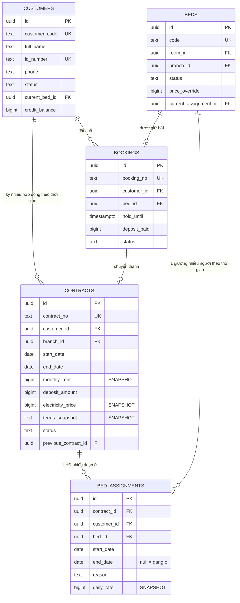
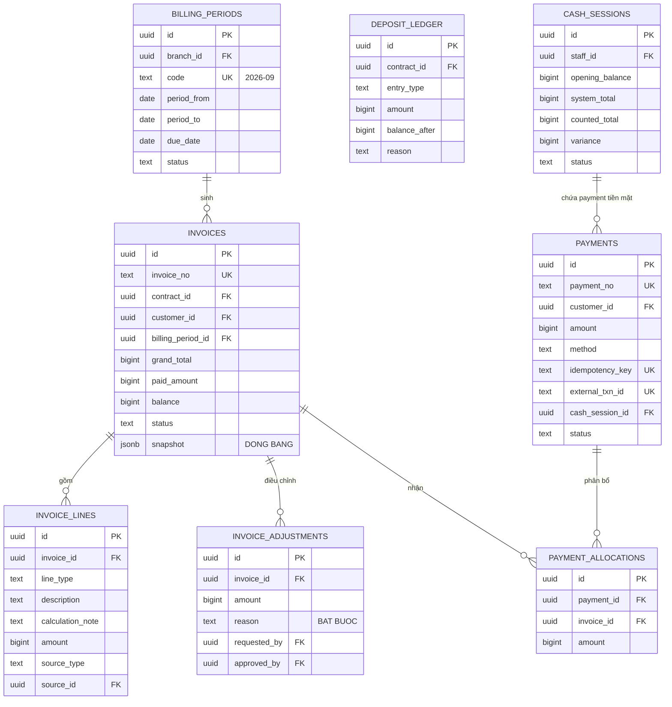
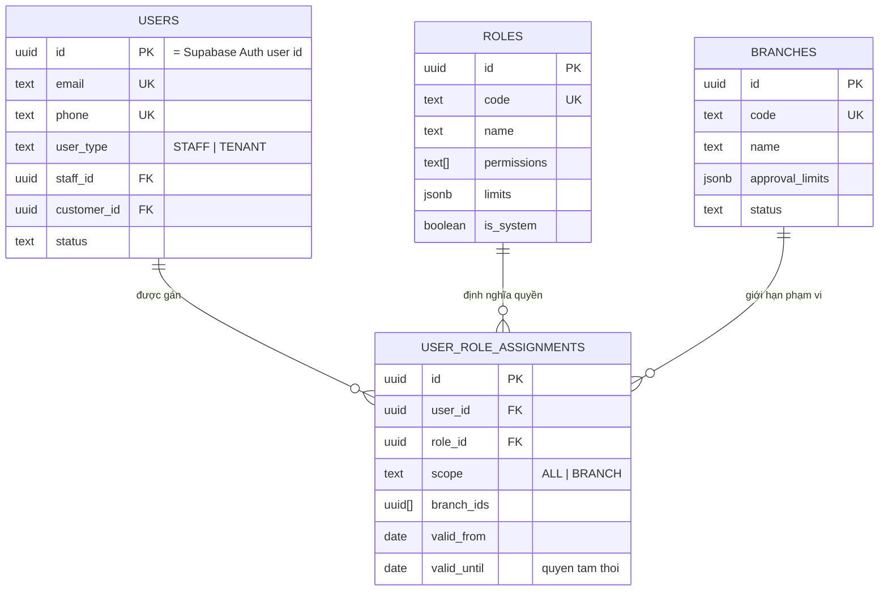
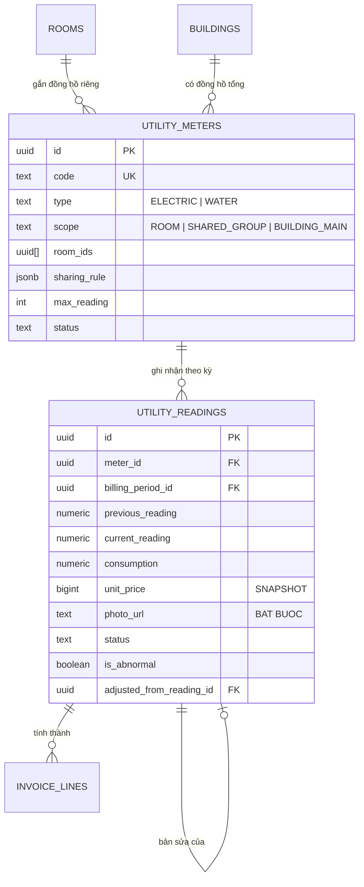
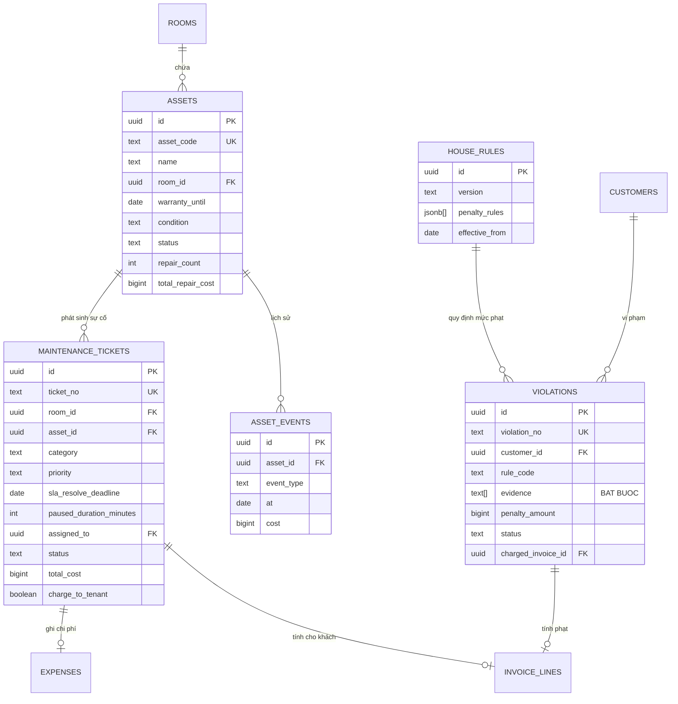

# 13 — ERD (Entity Relationship Diagram)

> PostgreSQL có khóa ngoại (FK) cưỡng chế thật — khác với thiết kế MongoDB trước đây phải tự đảm bảo quan hệ logic ở tầng ứng dụng. ERD dưới đây mô tả các bảng và FK; ràng buộc duy nhất bổ sung bằng unique/partial index.
>
> Xem [12-database-schema.md](12-database-schema.md) cho chi tiết cột và index.

---

## 1. ERD tổng thể

```mermaid
erDiagram
    ORGANIZATIONS ||--o{ BRANCHES : "có"
    BRANCHES ||--o{ BUILDINGS : "có"
    BUILDINGS ||--o{ FLOORS : "có"
    FLOORS ||--o{ ROOMS : "có"
    ROOM_TYPES ||--o{ ROOMS : "phân loại"
    BRANCHES ||--o{ ROOM_TYPES : "định nghĩa"
    ROOMS ||--o{ BEDS : "có"

    USERS ||--o{ USER_ROLE_ASSIGNMENTS : "được gán"
    ROLES ||--o{ USER_ROLE_ASSIGNMENTS : "cấp quyền"
    BRANCHES ||--o{ USER_ROLE_ASSIGNMENTS : "giới hạn phạm vi"
    STAFF ||--|| USERS : "có tài khoản"
    CUSTOMERS ||--o| USERS : "có tài khoản portal"

    CUSTOMERS ||--o{ CUSTOMER_DOCUMENTS : "sở hữu"
    CUSTOMERS ||--o{ BOOKINGS : "tạo"
    BOOKINGS ||--o| CONTRACTS : "chuyển thành"
    CUSTOMERS ||--o{ CONTRACTS : "ký"
    CONTRACTS ||--o{ BED_ASSIGNMENTS : "hiện thực bằng"
    BEDS ||--o{ BED_ASSIGNMENTS : "được ở bởi"
    CONTRACTS ||--o{ CHECKIN_CHECKOUT_RECORDS : "có biên bản"
    CONTRACTS ||--o| CONTRACTS : "gia hạn thành"

    BILLING_PERIODS ||--o{ INVOICES : "sinh ra"
    CONTRACTS ||--o{ INVOICES : "phát sinh"
    INVOICES ||--o{ INVOICE_LINES : "gồm"
    INVOICES ||--o{ INVOICE_ADJUSTMENTS : "được điều chỉnh"
    INVOICES ||--o{ PAYMENT_ALLOCATIONS : "được thanh toán qua"
    PAYMENTS ||--o{ PAYMENT_ALLOCATIONS : "phân bổ vào"
    CUSTOMERS ||--o{ PAYMENTS : "thanh toán"
    CASH_SESSIONS ||--o{ PAYMENTS : "thu tiền mặt trong"
    STAFF ||--o{ CASH_SESSIONS : "mở ca"
    CONTRACTS ||--o{ DEPOSIT_LEDGER : "sổ cọc"
    BRANCHES ||--o{ EXPENSES : "phát sinh"

    ROOMS ||--o{ UTILITY_METERS : "gắn"
    UTILITY_METERS ||--o{ UTILITY_READINGS : "ghi nhận"
    BILLING_PERIODS ||--o{ UTILITY_READINGS : "thuộc kỳ"
    UTILITY_READINGS ||--o{ INVOICE_LINES : "tính thành"

    BRANCHES ||--o{ SERVICES : "cung cấp"
    SERVICES ||--o{ SERVICE_SUBSCRIPTIONS : "được đăng ký"
    CONTRACTS ||--o{ SERVICE_SUBSCRIPTIONS : "bao gồm"
    SERVICES ||--o{ SERVICE_USAGES : "được sử dụng"

    ROOMS ||--o{ MAINTENANCE_TICKETS : "phát sinh sự cố"
    MAINTENANCE_TICKETS ||--o{ TICKET_EVENTS : "ghi lịch sử"
    ASSETS ||--o{ ASSET_EVENTS : "lịch sử"
    ROOMS ||--o{ ASSETS : "chứa"
    MAINTENANCE_TICKETS }o--o| ASSETS : "liên quan"
    MAINTENANCE_TICKETS }o--o| EXPENSES : "phát sinh chi phí"
    BEDS ||--o{ HOUSEKEEPING_TASKS : "cần dọn"

    HOUSE_RULES ||--o{ VIOLATIONS : "quy định"
    CUSTOMERS ||--o{ VIOLATIONS : "vi phạm"
    VIOLATIONS ||--o{ INVOICE_LINES : "tính phạt vào"

    CUSTOMERS ||--o{ VISITOR_LOGS : "tiếp khách"
    USERS ||--o{ AUDIT_LOGS : "thực hiện"
    USERS ||--o{ NOTIFICATIONS : "nhận"
    CUSTOMERS ||--o{ NOTIFICATIONS : "nhận"
```



---

## 2. Lõi lưu trú — quan hệ quan trọng nhất

Đây là phần thiết kế quyết định chất lượng của cả hệ thống.



### Vì sao tách `CONTRACTS` và `BED_ASSIGNMENTS`

| | `contracts` | `bed_assignments` |
|---|---|---|
| **Bản chất** | Quan hệ pháp lý & thương mại | Sự kiện vật lý |
| **Trả lời câu hỏi** | "Khách cam kết gì, giá bao nhiêu, đến bao giờ?" | "Khách thực tế nằm ở đâu, từ ngày nào?" |
| **Thay đổi khi** | Ký mới, gia hạn, làm phụ lục | Chuyển giường, chuyển phòng, chuyển chi nhánh |
| **Số lượng** | 1 hợp đồng | 1..n assignment |

**Hệ quả tích cực:**

1. **Tính tiền phòng tự động prorate.** Engine chỉ cần duyệt các assignment giao với kỳ tính. Nghiệp vụ "chuyển phòng giữa tháng" không cần một dòng code đặc biệt nào.

2. **Lịch sử đầy đủ hai chiều.** `bed_id` → ai từng ở giường này. `customer_id` → khách này từng ở đâu.

3. **Chống bán trùng ở tầng database.**
   ```sql
   CREATE UNIQUE INDEX bed_assignments_one_open_per_bed
     ON bed_assignments (bed_id)
     WHERE end_date IS NULL;
   ```
   Một giường chỉ có tối đa một assignment đang mở. Ràng buộc này bắt được cả race condition mà logic ứng dụng bỏ sót — Postgres chặn ở mức constraint, không cần transaction đặc biệt để đảm bảo.

4. **Chuyển chi nhánh xử lý được.** Assignment mới có `branch_id` khác → doanh thu tự phân bổ đúng chi nhánh, không cần logic riêng.

**Nếu làm sai** (nhét `bed_id` vào `contracts`):
- Chuyển phòng buộc phải tạo hợp đồng mới (sai về pháp lý) hoặc sửa hợp đồng đang chạy (mất lịch sử)
- Mọi nơi tính tiền phải viết logic đặc biệt tra cứu log chuyển phòng
- Báo cáo "giường này năm qua ai ở" gần như không làm được

---

## 3. Lõi tài chính



### Bốn nguyên tắc đọc từ sơ đồ này

1. **`INVOICES` có `snapshot`** — đóng băng tên khách, phòng, giá tại thời điểm phát hành. Xem lại hóa đơn cũ vẫn ra đúng nội dung cũ (không có file PDF lưu sẵn, nhưng dữ liệu hiển thị luôn đúng lịch sử nhờ snapshot này).

2. **`INVOICE_ADJUSTMENTS` tồn tại vì hóa đơn `ISSUED` bất biến.** Không có API sửa hóa đơn. Điều chỉnh là bản ghi mới, có lý do bắt buộc, có người duyệt khác người đề xuất.

3. **`PAYMENT_ALLOCATIONS` là bảng trung gian n-n** — một khoản trả nhiều hóa đơn, một hóa đơn nhận nhiều khoản. Không thể gắn `invoice_id` trực tiếp vào `payments`.

4. **`DEPOSIT_LEDGER` là sổ cái, tách hoàn toàn khỏi doanh thu.** Mỗi thao tác một bút toán, có `balance_after` để đối chiếu. Cọc không bao giờ xuất hiện trong báo cáo doanh thu.

5. **`external_txn_id`/`idempotency_key` là unique constraint thật ở Postgres** — nền tảng chống ghi trùng khi webhook VietQR/Casso/SePay gọi lại nhiều lần cho cùng một giao dịch (xem [11-architecture.md §11](11-architecture.md)).

---

## 4. Lõi phân quyền



Ba lớp kiểm soát rút ra từ sơ đồ:
- **Permission** (`roles.permissions`) — được làm hành động gì
- **Scope** (`user_role_assignments.scope` + `branch_ids`) — trên dữ liệu chi nhánh nào, cưỡng chế bằng **Row-Level Security** ở Postgres
- **Limit** (`roles.limits` + `branches.approval_limits`) — trong hạn mức nào

Ba lớp này đều kiểm tra ở backend (lớp Scope còn được database tự chặn thêm qua RLS). Xem [11-architecture.md §2 D5](11-architecture.md).

---

## 5. Lõi điện nước



Điểm quan trọng: `unit_price` snapshot trong `utility_readings`, và cũng snapshot trong `contracts`. Tăng giá điện không ảnh hưởng hồi tố các kỳ đã tính.

Đồng hồ tổng tòa nhà (`scope = BUILDING_MAIN`) dùng để đối chiếu với tổng các phòng — chênh lệch lớn là dấu hiệu rò rỉ hoặc câu trộm.

---

## 6. Lõi vận hành



Điểm đáng chú ý: ticket bảo trì dẫn tới **hai nhánh tài chính khác nhau** — `expenses` (Cali chịu) hoặc `invoice_lines` (khách chịu). Quyết định thuộc về Branch Manager, không để kỹ thuật tự quyết.

---

## 7. Ma trận quan hệ tóm tắt

| Từ | Tới | Kiểu | Ghi chú |
|---|---|---|---|
| organizations | branches | 1-n | |
| branches | buildings | 1-n | Luôn ≥1 |
| buildings | floors | 1-n | |
| floors | rooms | 1-n | Tầng có thể 0 phòng |
| room_types | rooms | 1-n | Định nghĩa theo chi nhánh |
| rooms | beds | 1-n | |
| customers | bookings | 1-n | |
| bookings | contracts | 1-0..1 | |
| customers | contracts | 1-n | Theo thời gian |
| contracts | contracts | 1-0..1 | Gia hạn (`previous_contract_id`) |
| **contracts** | **bed_assignments** | **1-n** | ★ Quan hệ then chốt |
| **beds** | **bed_assignments** | **1-n** | ★ Lịch sử người ở |
| billing_periods | invoices | 1-n | |
| contracts | invoices | 1-n | Unique theo `(contract_id, billing_period_id)` |
| invoices | invoice_lines | 1-n | |
| invoices | invoice_adjustments | 1-n | |
| **payments ↔ invoices** | payment_allocations | **n-n** | ★ Bảng trung gian |
| cash_sessions | payments | 1-n | Chỉ payment tiền mặt |
| contracts | deposit_ledger | 1-n | Sổ cái |
| rooms | utility_meters | 1-n | Có thể dùng chung |
| utility_meters | utility_readings | 1-n | Unique theo `(meter_id, billing_period_id)` |
| branches | services | 1-n | Cấu hình riêng từng chi nhánh |
| contracts | service_subscriptions | 1-n | |
| rooms | assets | 1-n | |
| assets | maintenance_tickets | 1-n | |
| assets | asset_events | 1-n | |
| customers | violations | 1-n | |
| customers | visitor_logs | 1-n | |
| users ↔ roles ↔ branches | user_role_assignments | n-n-n | |
