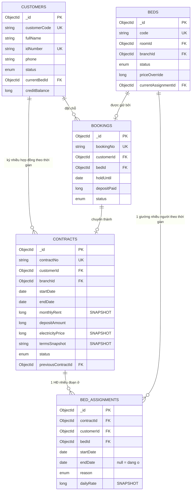
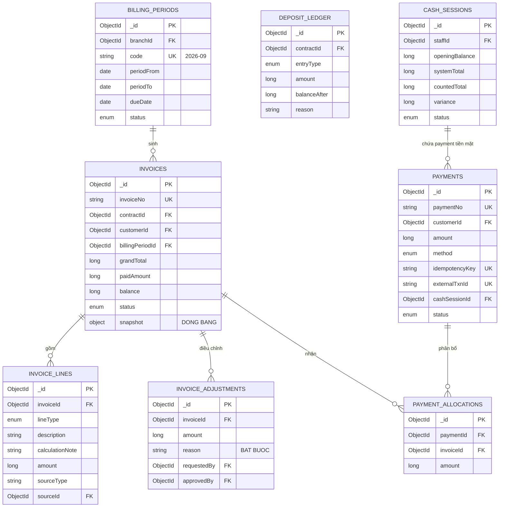
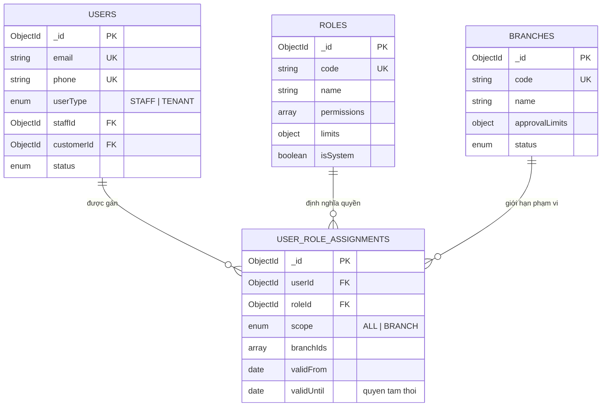
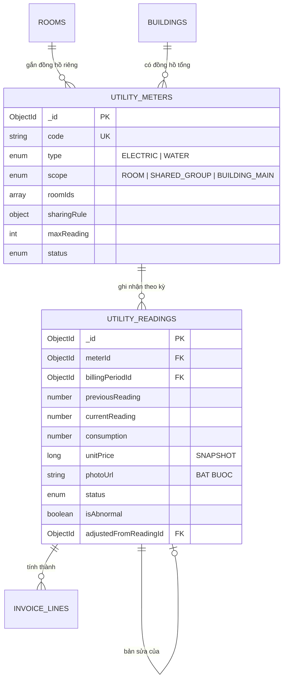
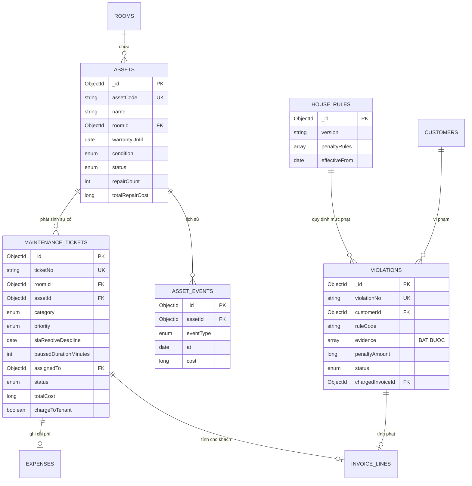

# 13 — ERD (Entity Relationship Diagram)

> MongoDB không có khóa ngoại cưỡng chế, nhưng quan hệ logic vẫn tồn tại và vẫn phải thiết kế đúng. ERD dưới đây mô tả quan hệ logic; ràng buộc được đảm bảo ở tầng ứng dụng và bằng unique index.
>
> Xem [12-database-schema.md](12-database-schema.md) cho chi tiết field và index.

---

## 1. ERD tổng thể

```mermaid
erDiagram
    ORGANIZATIONS ||--o{ BRANCHES : "có"
    BRANCHES ||--o{ BUILDINGS : "có"
    BUILDINGS ||--o{ FLOORS : "có"
    FLOORS ||--o{ ROOMS : "có"
    ROOM_TYPES ||--o{ ROOMS : "phân loại"
    BRANCHES ||--o{ ROOM_TYPES : "định nghĩa"
    ROOMS ||--o{ BEDS : "có"

    USERS ||--o{ USER_ROLE_ASSIGNMENTS : "được gán"
    ROLES ||--o{ USER_ROLE_ASSIGNMENTS : "cấp quyền"
    BRANCHES ||--o{ USER_ROLE_ASSIGNMENTS : "giới hạn phạm vi"
    STAFF ||--|| USERS : "có tài khoản"
    CUSTOMERS ||--o| USERS : "có tài khoản portal"

    CUSTOMERS ||--o{ CUSTOMER_DOCUMENTS : "sở hữu"
    CUSTOMERS ||--o{ BOOKINGS : "tạo"
    BOOKINGS ||--o| CONTRACTS : "chuyển thành"
    CUSTOMERS ||--o{ CONTRACTS : "ký"
    CONTRACTS ||--o{ BED_ASSIGNMENTS : "hiện thực bằng"
    BEDS ||--o{ BED_ASSIGNMENTS : "được ở bởi"
    CONTRACTS ||--o{ CHECKIN_CHECKOUT_RECORDS : "có biên bản"
    CONTRACTS ||--o| CONTRACTS : "gia hạn thành"

    BILLING_PERIODS ||--o{ INVOICES : "sinh ra"
    CONTRACTS ||--o{ INVOICES : "phát sinh"
    INVOICES ||--o{ INVOICE_LINES : "gồm"
    INVOICES ||--o{ INVOICE_ADJUSTMENTS : "được điều chỉnh"
    INVOICES ||--o{ PAYMENT_ALLOCATIONS : "được thanh toán qua"
    PAYMENTS ||--o{ PAYMENT_ALLOCATIONS : "phân bổ vào"
    CUSTOMERS ||--o{ PAYMENTS : "thanh toán"
    CASH_SESSIONS ||--o{ PAYMENTS : "thu tiền mặt trong"
    STAFF ||--o{ CASH_SESSIONS : "mở ca"
    CONTRACTS ||--o{ DEPOSIT_LEDGER : "sổ cọc"
    BRANCHES ||--o{ EXPENSES : "phát sinh"

    ROOMS ||--o{ UTILITY_METERS : "gắn"
    UTILITY_METERS ||--o{ UTILITY_READINGS : "ghi nhận"
    BILLING_PERIODS ||--o{ UTILITY_READINGS : "thuộc kỳ"
    UTILITY_READINGS ||--o{ INVOICE_LINES : "tính thành"

    BRANCHES ||--o{ SERVICES : "cung cấp"
    SERVICES ||--o{ SERVICE_SUBSCRIPTIONS : "được đăng ký"
    CONTRACTS ||--o{ SERVICE_SUBSCRIPTIONS : "bao gồm"
    SERVICES ||--o{ SERVICE_USAGES : "được sử dụng"

    ROOMS ||--o{ MAINTENANCE_TICKETS : "phát sinh sự cố"
    MAINTENANCE_TICKETS ||--o{ TICKET_EVENTS : "ghi lịch sử"
    ASSETS ||--o{ ASSET_EVENTS : "lịch sử"
    ROOMS ||--o{ ASSETS : "chứa"
    MAINTENANCE_TICKETS }o--o| ASSETS : "liên quan"
    MAINTENANCE_TICKETS }o--o| EXPENSES : "phát sinh chi phí"
    BEDS ||--o{ HOUSEKEEPING_TASKS : "cần dọn"

    HOUSE_RULES ||--o{ VIOLATIONS : "quy định"
    CUSTOMERS ||--o{ VIOLATIONS : "vi phạm"
    VIOLATIONS ||--o{ INVOICE_LINES : "tính phạt vào"

    CUSTOMERS ||--o{ VISITOR_LOGS : "tiếp khách"
    USERS ||--o{ AUDIT_LOGS : "thực hiện"
    USERS ||--o{ NOTIFICATIONS : "nhận"
    CUSTOMERS ||--o{ NOTIFICATIONS : "nhận"
```



---

## 2. Lõi lưu trú — quan hệ quan trọng nhất

Đây là phần thiết kế quyết định chất lượng của cả hệ thống.



### Vì sao tách `CONTRACTS` và `BED_ASSIGNMENTS`

| | `contracts` | `bed_assignments` |
|---|---|---|
| **Bản chất** | Quan hệ pháp lý & thương mại | Sự kiện vật lý |
| **Trả lời câu hỏi** | "Khách cam kết gì, giá bao nhiêu, đến bao giờ?" | "Khách thực tế nằm ở đâu, từ ngày nào?" |
| **Thay đổi khi** | Ký mới, gia hạn, làm phụ lục | Chuyển giường, chuyển phòng, chuyển chi nhánh |
| **Số lượng** | 1 hợp đồng | 1..n assignment |

**Hệ quả tích cực:**

1. **Tính tiền phòng tự động prorate.** Engine chỉ cần duyệt các assignment giao với kỳ tính. Nghiệp vụ "chuyển phòng giữa tháng" không cần một dòng code đặc biệt nào.

2. **Lịch sử đầy đủ hai chiều.** `{bedId}` → ai từng ở giường này. `{customerId}` → khách này từng ở đâu.

3. **Chống bán trùng ở tầng database.**
   ```js
   db.bed_assignments.createIndex(
     { bedId: 1 },
     { unique: true, partialFilterExpression: { endDate: null } }
   )
   ```
   Một giường chỉ có tối đa một assignment đang mở. Ràng buộc này bắt được cả race condition mà logic ứng dụng bỏ sót.

4. **Chuyển chi nhánh xử lý được.** Assignment mới có `branchId` khác → doanh thu tự phân bổ đúng chi nhánh, không cần logic riêng.

**Nếu làm sai** (nhét `bedId` vào `contracts`):
- Chuyển phòng buộc phải tạo hợp đồng mới (sai về pháp lý) hoặc sửa hợp đồng đang chạy (mất lịch sử)
- Mọi nơi tính tiền phải viết logic đặc biệt tra cứu log chuyển phòng
- Báo cáo "giường này năm qua ai ở" gần như không làm được

---

## 3. Lõi tài chính



### Bốn nguyên tắc đọc từ sơ đồ này

1. **`INVOICES` có `snapshot`** — đóng băng tên khách, phòng, giá tại thời điểm phát hành. In lại hóa đơn cũ ra đúng nội dung cũ.

2. **`INVOICE_ADJUSTMENTS` tồn tại vì hóa đơn `ISSUED` bất biến.** Không có API sửa hóa đơn. Điều chỉnh là bản ghi mới, có lý do bắt buộc, có người duyệt khác người đề xuất.

3. **`PAYMENT_ALLOCATIONS` là bảng trung gian n-n** — một khoản trả nhiều hóa đơn, một hóa đơn nhận nhiều khoản. Không thể gắn `invoiceId` trực tiếp vào `payments`.

4. **`DEPOSIT_LEDGER` là sổ cái, tách hoàn toàn khỏi doanh thu.** Mỗi thao tác một bút toán, có `balanceAfter` để đối chiếu. Cọc không bao giờ xuất hiện trong báo cáo doanh thu.

---

## 4. Lõi phân quyền



Ba lớp kiểm soát rút ra từ sơ đồ:
- **Permission** (`roles.permissions`) — được làm hành động gì
- **Scope** (`user_role_assignments.scope` + `branchIds`) — trên dữ liệu chi nhánh nào
- **Limit** (`roles.limits` + `branches.approvalLimits`) — trong hạn mức nào

Ba lớp này đều kiểm tra ở backend. Xem [11-architecture.md §2 D5](11-architecture.md).

---

## 5. Lõi điện nước



Điểm quan trọng: `unitPrice` snapshot trong `utility_readings`, và cũng snapshot trong `contracts`. Tăng giá điện không ảnh hưởng hồi tố các kỳ đã tính.

Đồng hồ tổng tòa nhà (`scope = BUILDING_MAIN`) dùng để đối chiếu với tổng các phòng — chênh lệch lớn là dấu hiệu rò rỉ hoặc câu trộm.

---

## 6. Lõi vận hành



Điểm đáng chú ý: ticket bảo trì dẫn tới **hai nhánh tài chính khác nhau** — `expenses` (Cali chịu) hoặc `invoice_lines` (khách chịu). Quyết định thuộc về Branch Manager, không để kỹ thuật tự quyết.

---

## 7. Ma trận quan hệ tóm tắt

| Từ | Tới | Kiểu | Ghi chú |
|---|---|---|---|
| organizations | branches | 1-n | |
| branches | buildings | 1-n | Luôn ≥1 |
| buildings | floors | 1-n | |
| floors | rooms | 1-n | Tầng có thể 0 phòng |
| room_types | rooms | 1-n | Định nghĩa theo chi nhánh |
| rooms | beds | 1-n | |
| customers | bookings | 1-n | |
| bookings | contracts | 1-0..1 | |
| customers | contracts | 1-n | Theo thời gian |
| contracts | contracts | 1-0..1 | Gia hạn (`previousContractId`) |
| **contracts** | **bed_assignments** | **1-n** | ★ Quan hệ then chốt |
| **beds** | **bed_assignments** | **1-n** | ★ Lịch sử người ở |
| billing_periods | invoices | 1-n | |
| contracts | invoices | 1-n | Unique theo `(contractId, billingPeriodId)` |
| invoices | invoice_lines | 1-n | |
| invoices | invoice_adjustments | 1-n | |
| **payments ↔ invoices** | payment_allocations | **n-n** | ★ Bảng trung gian |
| cash_sessions | payments | 1-n | Chỉ payment tiền mặt |
| contracts | deposit_ledger | 1-n | Sổ cái |
| rooms | utility_meters | 1-n | Có thể dùng chung |
| utility_meters | utility_readings | 1-n | Unique theo `(meterId, billingPeriodId)` |
| branches | services | 1-n | Cấu hình riêng từng chi nhánh |
| contracts | service_subscriptions | 1-n | |
| rooms | assets | 1-n | |
| assets | maintenance_tickets | 1-n | |
| assets | asset_events | 1-n | |
| customers | violations | 1-n | |
| customers | visitor_logs | 1-n | |
| users ↔ roles ↔ branches | user_role_assignments | n-n-n | |
