# 14 — Workflow nghiệp vụ

12 quy trình cốt lõi. Mỗi quy trình gồm: sơ đồ, các bước hệ thống thực hiện, và điểm dễ sai nhất.

---

## 1. Khách đăng ký thuê KTX

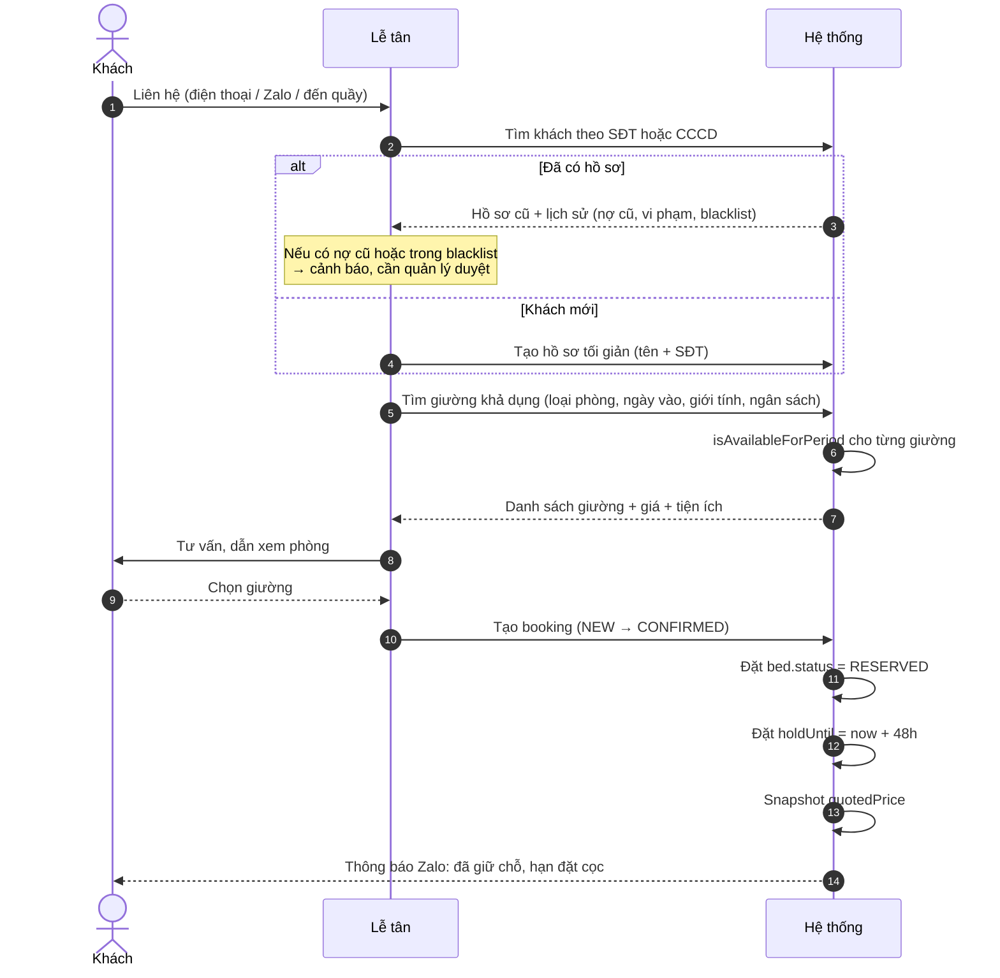

**Điểm dễ sai:** không đặt `holdUntil`. Hệ quả: lễ tân giữ giường cho khách "đang suy nghĩ", giường bị khóa ảo hàng tuần, tỷ lệ lấp đầy tụt mà không ai biết nguyên nhân.

---

## 2. Đặt cọc

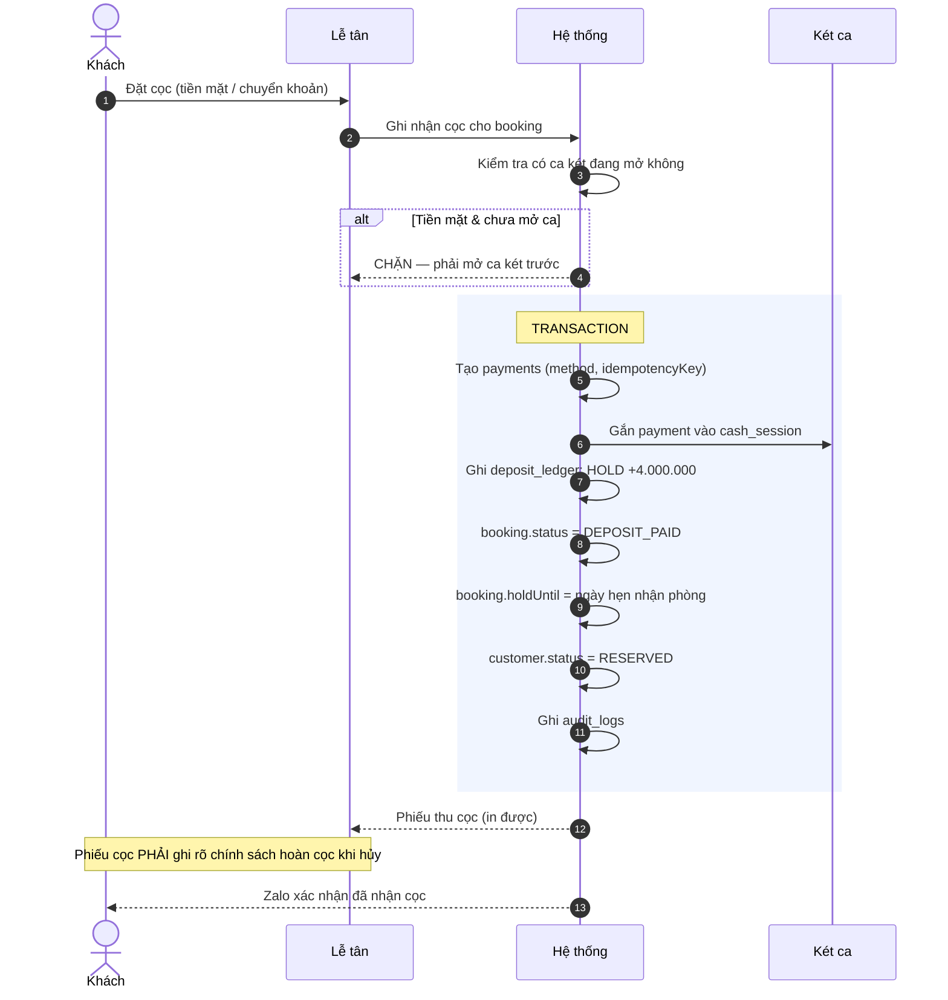

**Điểm dễ sai:**
1. **Ghi cọc vào doanh thu.** Cọc là công nợ phải trả. Phải vào `deposit_ledger`, không vào báo cáo doanh thu.
2. **Không ghi chính sách hoàn cọc lên phiếu.** Mọi tranh chấp sau này đều thua.

---

## 3. Check-in

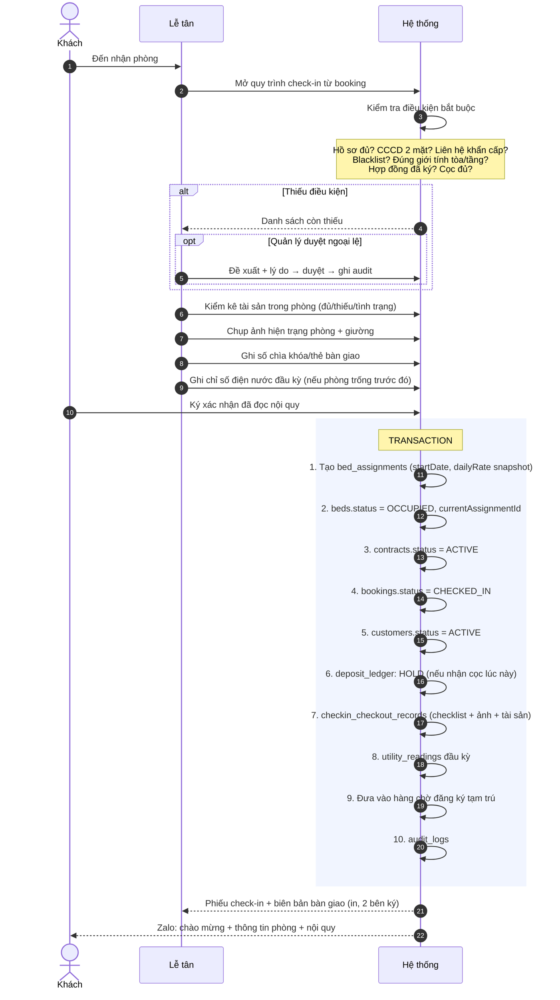

**Điểm dễ sai:**
1. **Không dùng transaction.** Hệ quả: khách đang ở mà không có hợp đồng, hoặc giường `OCCUPIED` mà không ai ở. Loại dữ liệu rác này rất khó phát hiện và sửa.
2. **Bỏ qua bước chụp ảnh.** Đến lúc check-out không có gì đối chiếu, mọi tranh chấp cọc đều thua.

---

## 4. Sinh hợp đồng

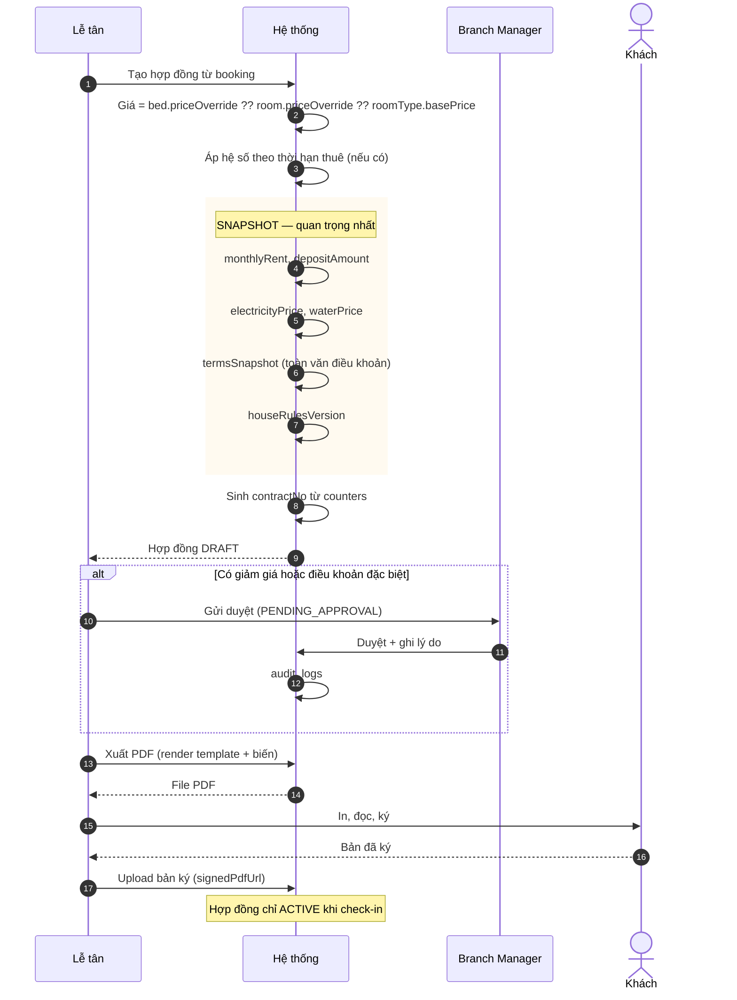

**Điểm dễ sai:** **không snapshot điều khoản và giá.** Nếu hợp đồng chỉ trỏ tới `templateId` và bảng giá, thì khi sửa template hoặc tăng giá, mọi hợp đồng cũ đều "thay đổi nội dung" — mất giá trị pháp lý hoàn toàn.

---

## 5. Sinh hóa đơn tháng

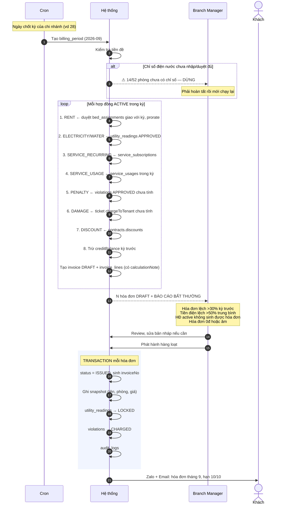

**Điểm dễ sai:**
1. **Tự động phát hành thẳng không qua review.** Tháng nào cũng có vài trường hợp bất thường. Phát hành sai rồi phải làm bút toán điều chỉnh — rất mất công và mất uy tín.
2. **Quên `calculationNote`.** Khách hỏi "sao tiền điện cao vậy" mà lễ tân không giải thích được.

---

## 6. Thanh toán

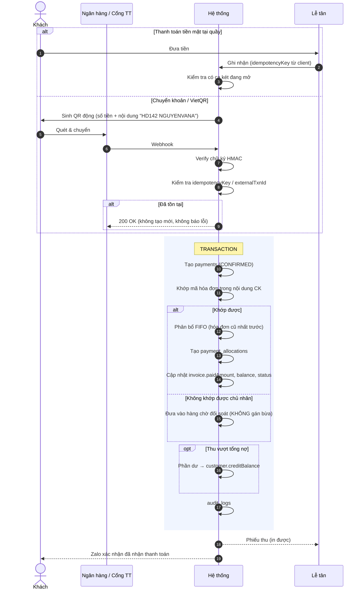

**Điểm dễ sai:**
1. **Không có idempotency key.** Webhook retry → ghi nhận 2 lần → khách được ghi thừa tiền → phát hiện muộn.
2. **Trả lỗi cho webhook trùng.** Ngân hàng sẽ retry mãi. Phải trả `200 OK`.
3. **Gán bừa khoản chuyển khoản không rõ chủ.** Tạo sai lệch rất khó lần ra.

---

## 7. Quá hạn thanh toán

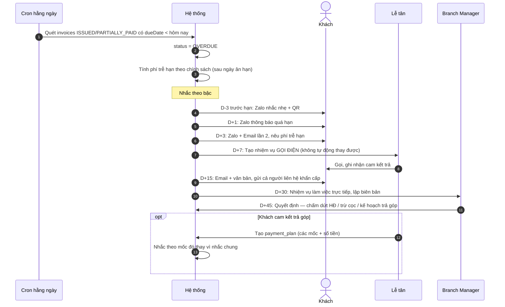

**Điểm dễ sai:** để hệ thống nhắc mãi bằng tin nhắn. Sau D+7 phải có **con người gọi điện**. Tin nhắn tự động sau mốc đó gần như vô tác dụng, chỉ làm khách chai lì.

---

## 8. Chuyển giường / chuyển phòng

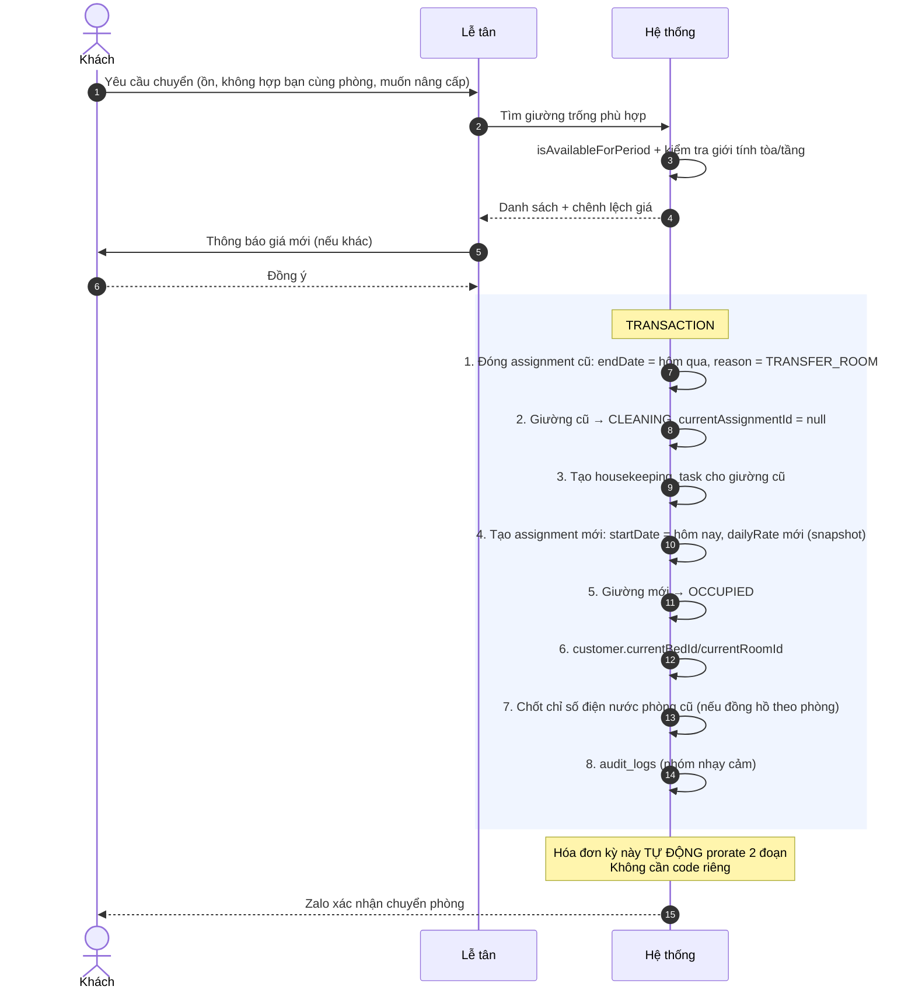

**Điểm dễ sai:** **sửa assignment cũ thay vì đóng nó và mở cái mới.** Làm vậy là mất lịch sử, và hóa đơn sẽ tính sai toàn bộ khoảng thời gian trước khi chuyển.

---

## 9. Gia hạn hợp đồng

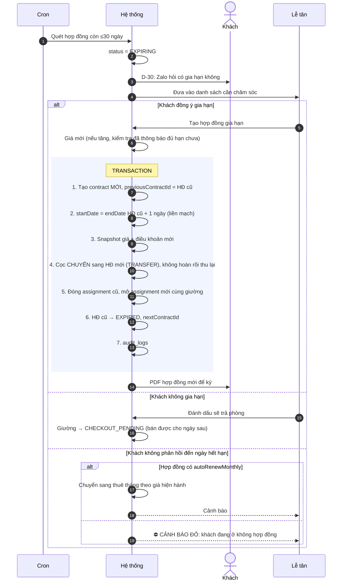

**Điểm dễ sai:** **hoàn cọc rồi thu cọc lại** khi gia hạn. Vừa mất công vừa tạo hai giao dịch tiền không cần thiết, dễ sai sót. Dùng bút toán `TRANSFER` trong sổ cọc.

---

## 10. Check-out

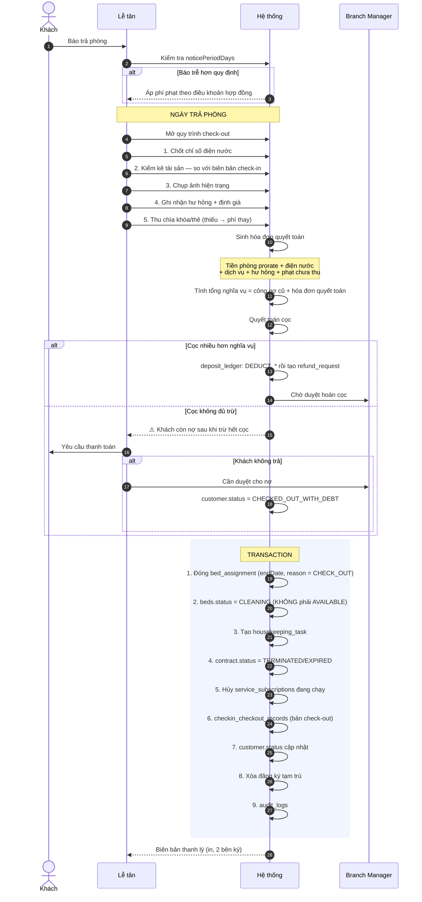

**Điểm dễ sai:**
1. **Đưa giường thẳng về `AVAILABLE`.** Hệ thống sẽ bán giường chưa dọn. Đây là lỗi vận hành gây khiếu nại nhiều nhất.
2. **Chặn cứng check-out khi còn nợ.** Khách sẽ đi dù sao. Thay vào đó: cảnh báo, cần duyệt, trừ tối đa vào cọc, ghi nhận phần còn lại.

---

## 11. Hoàn cọc

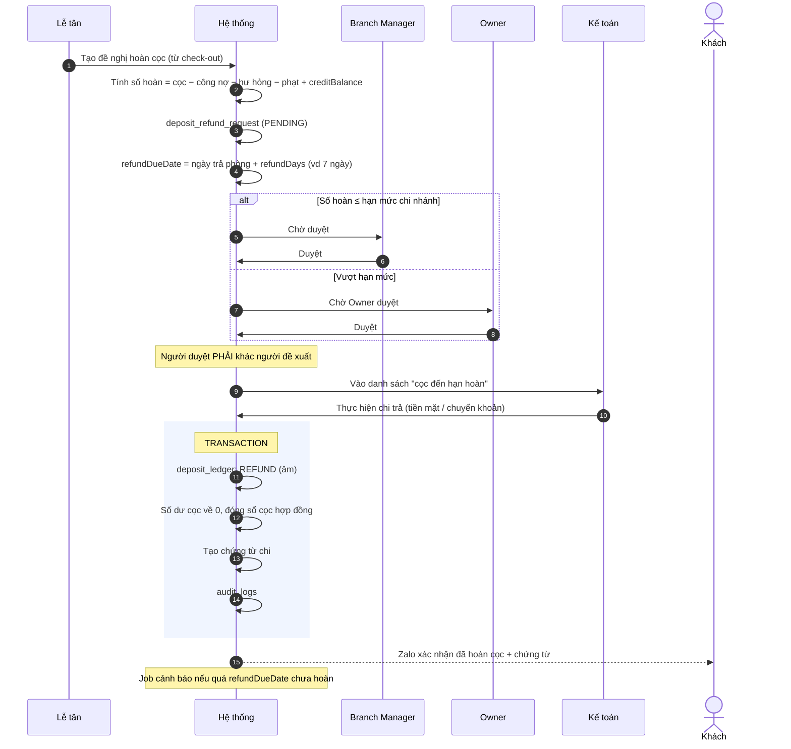

**Điểm dễ sai:** **không theo dõi "cọc đến hạn hoàn".** Khách phải tự đòi — đây là nguồn đánh giá xấu lớn nhất của mô hình KTX, và hoàn toàn tránh được bằng một danh sách trên dashboard kế toán.

---

## 12. Tạo & xử lý ticket bảo trì

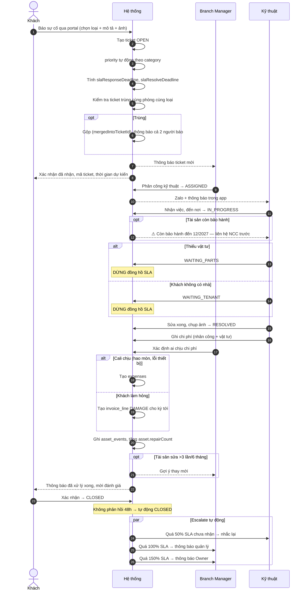

**Điểm dễ sai:** **đếm SLA cả thời gian chờ vật tư và chờ khách.** Kỹ thuật bị phạt oan vì lý do ngoài tầm kiểm soát, và họ sẽ ngừng cập nhật trạng thái trên hệ thống — mất luôn giá trị của module.

---

## Tổng kết: các nghiệp vụ BẮT BUỘC dùng transaction

| Nghiệp vụ | Số thao tác ghi | Hậu quả nếu không atomic |
|---|---|---|
| Check-in | 9–10 | Khách ở mà không có hợp đồng |
| Check-out | 9 | Giường giải phóng mà cọc chưa quyết toán |
| Đặt cọc | 5 | Tiền thu mà booking không cập nhật |
| Phát hành hóa đơn | 4 | Hóa đơn thiếu dòng chi tiết |
| Ghi nhận thanh toán | 4–5 | Tiền ghi nhận mà hóa đơn không cập nhật |
| Chuyển giường | 8 | Hai assignment cùng mở, hoặc không cái nào |
| Gia hạn hợp đồng | 7 | Hở ngày giữa hai hợp đồng, cọc mất dấu |
| Hoàn cọc | 4 | Chi tiền mà sổ cọc không ghi |

Đây là lý do **MongoDB replica set là bắt buộc**, không phải tùy chọn.
